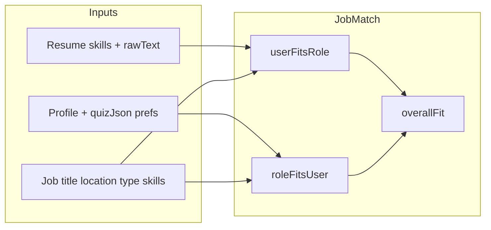

# Bidirectional match + bookmark-first discovery

## Product decisions (locked from your feedback)


| Decision           | Choice                                                                                                        |
| ------------------ | ------------------------------------------------------------------------------------------------------------- |
| Saved jobs UX      | **Matches** + **Bookmarked** tabs over the `SavedJob` set — no separate Watchlist route/model                  |
| You→Role scoring   | **CV/resume** vs employer requirements (do you meet the job)                                                  |
| Role→You scoring   | **User Profile** vs your specifications (does the job suit you) incl. personality + priorities + salary       |
| Match display      | **Three scores**: You → Role, Role → You, **Overall**                                                         |
| Scrape queries     | Unchanged — resume skill heuristics in `[src/app/api/jobs/scrape/route.ts](src/app/api/jobs/scrape/route.ts)` |





---

## Current state

- Single score: `[computeMatchScore](src/lib/job-matcher.ts)` → `JobMatch.matchScore` / `matchReason`, written in scrape + resume re-score paths.
- UI: one `[ScoreBadge](src/app/dashboard/jobs/page.tsx)` per card; bookmark already works via `POST /api/jobs/[id]/save`.
- Dashboard metric `[getJobMatchCount](src/lib/dashboard/dashboard-metrics.ts)` counts jobs with `matchScore >= 70`.
- Profile “user requirements” already exist: `targetSeniority`, `employmentTypePreference`, `salaryMin/Max`, `location`/`city`/`region`, `relocationWillingness`, `aspiringRole`, plus `quizJson.workMode` and `quizJson.roleType` (`[Profile](prisma/schema.prisma)`, `[career-preferences-section.tsx](src/components/profile/career-preferences-section.tsx)`).

---

## 1. Data model — extend `JobMatch`

Add columns (Prisma migration):


| Column               | Type   | Purpose                                         |
| -------------------- | ------ | ----------------------------------------------- |
| `userFitsRoleScore`  | `Int`  | Resume/CV vs job requirements (existing logic)  |
| `roleFitsUserScore`  | `Int?` | Job vs user prefs; `null` when prefs too sparse |
| `overallFitScore`    | `Int`  | Combined score used for sort + dashboard        |
| `matchBreakdownJson` | `Json` | Per-dimension reasons (Zod-validated at write)  |


**Backward compatibility:** migrate existing rows: `userFitsRoleScore = matchScore`, `overallFitScore = matchScore`, `roleFitsUserScore = null`. Deprecate direct use of `matchScore` in app code (keep column temporarily or alias in migration).

---

## 2. Scoring engine — refactor `[src/lib/job-matcher.ts](src/lib/job-matcher.ts)`

Split into three pure functions + one orchestrator:

### 2a. `computeUserFitsRole` (You → Role)

- Move current `computeMatchScore` logic here (keyword overlap + optional LLM refine).
- Improvements (same file, reuse patterns from `[match-icp.ts](src/lib/applications/job-insights/match-icp.ts)` **only** for skill aliases / word boundaries — do not call ICP on listings).
- Inputs: `resumeSkills`, `resumeText`, `jobTitle`, `jobDescription`, `requiredSkills`.
- Output: `{ score, reason, matchedSkills?, missingSkills? }`.

### 2b. `computeRoleFitsUser` (Role → You) — **Profile-driven**

Uses the **User Profile** (not the CV) to judge how well the role matches what the user *wants*. Heuristic computes the **number** (zero LLM, fast for every job in scrape batch); a natural-language explanation is generated lazily (see 2b-ii).

#### 2b-i. Scoring signals (deterministic)


| Signal              | Source                                               | Job signal                                | Scoring                                              |
| ------------------- | ---------------------------------------------------- | ----------------------------------------- | ---------------------------------------------------- |
| Work mode           | `quizJson.workMode`                                  | `job.locationType`                        | Match=100, flexible=80, mismatch=30                  |
| Seniority           | `targetSeniority`                                    | title keywords (intern/junior/mid/senior) | aligned / one-level-off / mismatch                   |
| Employment type     | `employmentTypePreference`                           | title + description keywords              | full-time / part-time / contract                     |
| Location            | `city`, `region`, `country`, `relocationWillingness` | `job.location` string                     | contains / country match / willing to relocate / far |
| Role direction      | `aspiringRole`                                       | `job.title`                               | token overlap or light string similarity             |
| Salary              | `salaryMin` (if set)                                 | parsed from description if present        | in-range / unknown (neutral 70) / below min          |
| Priorities          | `quizJson.priorities` (e.g. "challenge", "big team") | description keyword scan                  | each matched priority adds weight; unmatched neutral |
| Personality         | `personalityType` (e.g. ENTP-A)                      | role traits inferred from description     | soft modifier (+/- up to ~10), never a hard penalty  |
| Career trajectory   | `aspiringRole` + `experienceJson`                    | `job.title` + `job.description`           | See §2b-iii below — scored separately, shown as its own dimension |


- Only score dimensions where **both** sides have data; renormalize to 0–100 across active dimensions.
- Personality is a **flavour modifier**, not a gate — a great structural fit shouldn't be sunk by personality alone.
- If **no** preference signals filled → return `{ score: null, reason: "Add career preferences for role-fit scoring.", dimensions: [] }`.
- Store dimension breakdown in `matchBreakdownJson.roleFitsUser` (each dimension: `{ key, label, score, matched, detail }`).

#### 2b-iii. Career trajectory scoring (new dimension)

This is the **"is this role a step toward where you want to go?"** signal. It is the highest-value dimension for confident career decisions and needs its own treatment.

**Concept:** triangulate three points — where the user *has been* (experience history), where they *want to go* (aspiring role), and what *this job is* — to classify the role as a step forward, a lateral move, or a divergence.

**Inputs:**
- `profile.aspiringRole` — free text, e.g. "Senior Product Designer" or "Software Engineer at a startup"
- `profile.experienceJson[]` — structured entries: `{ role, company, startDate, endDate, bullets[] }` (bullets describe responsibilities/skills used)
- `job.title` + `job.description`

**Scoring algorithm (heuristic, zero LLM, run at scrape time):**

1. **Aspiration alignment** — token overlap between `aspiringRole` and `job.title`. High overlap = directly on the path. No `aspiringRole` = skip.
2. **Experience domain continuity** — extract domain keywords from the most recent 2–3 `experienceJson` roles (title tokens + bullet keywords). Check how many overlap with `job.description` / `job.requiredSkills`. High overlap = staying in an established lane.
3. **Seniority trajectory** — compare inferred level of most-recent role vs target seniority vs this job's inferred level. Is the progression logical? (e.g. junior → mid = forward; senior → intern = backward)
4. **Combine:**

```ts
trajectoryScore =
  0.5 * aspirationAlignment    // most weight — does it point toward the goal?
  + 0.3 * domainContinuity     // does it use what they've built?
  + 0.2 * seniorityProgression // is the level right for this stage?
```

**Classification labels** (shown in the dimension chip and explanation):

| Score | Label | Detail shown to user |
|-------|-------|----------------------|
| ≥ 80 | **Step forward** | "Directly on the path to [aspiringRole]." |
| 60–79 | **Lateral move** | "Adjacent to your current lane — broadens experience." |
| 40–59 | **Tangential** | "Overlaps some skills but takes you in a different direction." |
| < 40 | **Different direction** | "This role diverges from your [aspiringRole] goal." |

**Graceful degradation:**
- No `aspiringRole` set → skip aspiration alignment; fallback to domain continuity only.
- No `experienceJson` → skip domain continuity; rely on aspiration + seniority only.
- Neither available → dimension is omitted entirely (no null score penalty on overall).

**Why this matters in the explanation:** the LLM `explain-fit` prompt should specifically call out the trajectory verdict — e.g. *"Given your background in UX and your goal of becoming a Senior Product Designer, this role is a clear step forward toward where you want to be."*

#### 2b-ii. Confidence-building explanation (lazy LLM)

Goal: produce copy like *"Because you're an ENTP-A who wants a challenging role on a large team paying €70k+, this position is a strong 95% fit to your specifications — and given your background in UX, it's a clear step toward your goal of becoming a Senior Product Designer."*

- **Number stays deterministic** (2b-i). The LLM only **phrases** the reason from structured data: `matchBreakdownJson.roleFitsUser` + profile signals (`personalityType`, `quizJson.priorities`, `salaryMin`) + the **trajectory verdict** (`trajectoryScore`, `trajectoryLabel`, aspiring role text).
- **Lazy / generate-on-expand:** do NOT call the LLM per job during a scrape batch (cost). Generate the sentence only when the user **opens a card's breakdown**, via `POST /api/jobs/[id]/explain-fit`; cache the result on `matchBreakdownJson.roleFitsUser.explanation`.
- **Graceful degradation:** thinner profile → shorter sentence + a nudge ("Add your career goal to see how this role fits your trajectory"). With no LLM budget, fall back to a templated sentence built from matched dimensions including trajectory label.

> **Preferences-capture gap (flag):** the persuasive sentence wants "wants a challenge / big team / culture-fit" signals. Today `personalityType` and `salaryMin` are structured, but motivations live in free-text `quizJson.priorities`. This wave **consumes** whatever exists; a follow-up should add a small structured "what matters to you" preferences step to make these reasons consistently rich.

### 2c. `computeOverallFit`

Default formula (tunable constant in one place):

```ts
// When roleFitsUser is null: overall = userFitsRole
// Else: penalize one-sided mismatch
overall = round(0.5 * userFitsRole + 0.5 * roleFitsUser)
if (userFitsRole < 40 || roleFitsUser < 40) overall = min(overall, 55)
```

`matchReason` on the card becomes a short **overall** summary; full detail lives in breakdown JSON.

### 2d. `computeJobMatch` orchestrator

Single entry used by scrape + resume re-score:

```ts
computeJobMatch({ resume, profile, job }) → {
  userFitsRole, roleFitsUser, overallFit, breakdown
}
```

---

## 3. Pipeline wiring

Update writers to pass **profile** alongside resume:

- `[src/app/api/jobs/scrape/route.ts](src/app/api/jobs/scrape/route.ts)` — load `Profile` once per run; persist all three scores + JSON.
- `[src/app/api/resume/upload/route.ts](src/app/api/resume/upload/route.ts)` — re-score active cache with profile context.
- **New:** lightweight re-score trigger when profile career prefs / quiz save (server action in `[src/lib/profile/actions.ts](src/lib/profile/actions.ts)` or debounced API) — only if active resume exists.
- **New:** `POST /api/jobs/[id]/explain-fit` — lazily generates + caches the Role→You confidence sentence into `matchBreakdownJson.roleFitsUser.explanation` (LLM, only on card expand).

Readers:

- `[src/lib/jobs-api.ts](src/lib/jobs-api.ts)` — extend `JobListItem` with `userFitsRoleScore`, `roleFitsUserScore`, `overallFitScore`, `matchBreakdown`.
- `[src/app/api/jobs/route.ts](src/app/api/jobs/route.ts)` — sort by `overallFitScore` (nulls last); optional `?sort=userFitsRole|roleFitsUser` later.
- `[src/lib/dashboard/dashboard-metrics.ts](src/lib/dashboard/dashboard-metrics.ts)` — threshold on `overallFitScore`; optionally require both dimensions ≥ 50 for “strong match” count.

---

## 4. Jobs board UX — Matches + Bookmarked tabs

Two tabs on `[src/app/dashboard/jobs/page.tsx](src/app/dashboard/jobs/page.tsx)`. No dedicated Watchlist route/model — "Bookmarked" simply filters the existing `SavedJob` set.

### Tabs

- **Matches** — all scored listings (current behaviour), sorted by `overallFitScore`.
- **Bookmarked** — only `job.saved === true` (bookmarked ads), so users can compare fits side-by-side, e.g. when weighing multiple offers.

Implementation: `tab` state (`"matches" | "bookmarked"`). Reuse existing `all | remote | hybrid | onsite` work-mode filters **inside** each tab. Bookmarked count shown as a badge on the tab (`{savedCount}`).

### Match display component

Replace single `ScoreBadge` with `MatchFitBadge` (new component, e.g. `[src/components/jobs/match-fit-badge.tsx](src/components/jobs/match-fit-badge.tsx)`):

```
┌─────────────────────────┐
│  Overall 78%            │  ← primary color band (current ScoreBadge logic)
│  You→Role 85%  Role→You 68% │  ← compact sub-row
└─────────────────────────┘
```

- **At a glance:** overall % + two labeled sub-scores on every card.
- **You→Role** (CV vs employer requirements): popover lists matched / missing skills from `matchBreakdownJson.userFitsRole`. This is "do you meet what the employer wants" — always CV-driven.
- **Role→You** (Profile vs your specifications): popover shows the **confidence sentence** (2b-ii) plus per-dimension chips (work mode, seniority, salary, priorities, personality, **career trajectory**). Reason is fetched lazily on expand via `POST /api/jobs/[id]/explain-fit`.
- **Career trajectory chip** displayed prominently in the popover with a direction label: “Step forward ↑”, “Lateral move”, “Tangential”, “Different direction”. This is the at-a-glance career verdict.
- When `roleFitsUser` is null: show “—” for Role→You + link "Complete your preferences" → `/dashboard/profile`.

### Copy updates

- Page subtitle: mention **bidirectional** fit — "how well you fit each role, and how well each role fits you."
- Distinguish product terms: **Bookmark** (saved ad), **Saved search** (Wave 6), **Application** (tracked).

### Empty states

- **Matches** (no jobs): existing "Scan jobs" prompt.
- **Bookmarked** (none): “Bookmark roles you like to compare their fit here — handy when you have multiple offers to weigh.”

---

## 5. Explicitly out of scope (supersedes old Wave 5B todos)


| Removed                              | Reason                                                                       |
| ------------------------------------ | ---------------------------------------------------------------------------- |
| Separate Watchlist route + model     | Bookmarked tab over `SavedJob` replaces it                                   |
| ICP scoring on jobs board            | User rejected; keep on application `IcpFitPanel`                             |
| `UserNotification` bell in this wave | Defer; can later notify on bookmarked job score changes or saved-search runs |


**Wave 6** ([saved searches UI + scrape POST overrides](.cursor/plans/wave_6_saved_searches_6dfb8ba5.plan.md)) remains the next wave after this — orthogonal to bookmarks.

---

## 6. Verification checklist

- Scrape persists three scores; cards show Overall + You→Role + Role→You.
- User with resume only: You→Role + Overall work; Role→You shows nudge.
- User with prefs: Role→You reflects work mode / seniority mismatches on obvious test jobs.
- Bookmarked tab shows only `SavedJob` rows; heart toggle unchanged; count badge accurate.
- Role→You popover shows the personality/priority/salary confidence sentence; cached after first expand.
- Career trajectory chip appears on every card with one of the four labels (Step forward / Lateral / Tangential / Different direction).
- Trajectory explanation included in `explain-fit` LLM sentence when aspiring role or experience set.
- Sort order follows `overallFitScore`; dashboard match count uses overall.
- Application detail ICP unchanged (regression).
- Re-score after resume upload and profile pref update.

---

## 7. Docs

Update `[docs/MASTER_BUILD_PLAN.md](docs/MASTER_BUILD_PLAN.md)` §1.3: insert **Wave 5B — Bidirectional match + bookmark filter** before Wave 6; mark old Watchlist/ICP-on-board items cancelled.