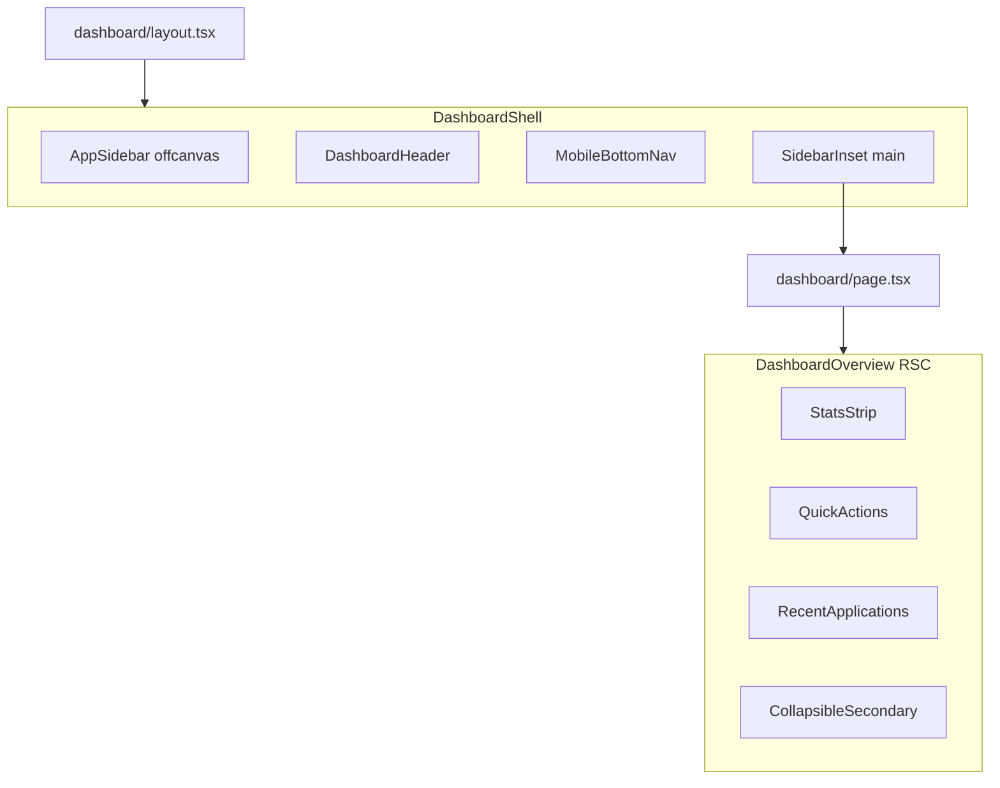

# Dashboard UI/UX Refactor Plan

## Current state (audit)

- [`src/app/dashboard/page.tsx`](src/app/dashboard/page.tsx) imports a **missing** [`dashboard-overview`](src/components/dashboard/dashboard-overview.tsx) — the overview is currently broken.
- **No** [`src/app/dashboard/layout.tsx`](src/app/dashboard/layout.tsx) — each child route (`jobs`, `resume`, `chat`, etc.) renders its own sticky header with `ArrowLeft` back to `/dashboard`.
- [`src/components/ui/sidebar.tsx`](src/components/ui/sidebar.tsx) (shadcn) exists but is **unused** anywhere in the app.
- Brand tokens are ready in [`src/styles/guava-tokens.css`](src/styles/guava-tokens.css): **pink = guava flesh (primary ~70%)**, **green = skin/leaves (accent ~30%)**. Rule: never pink→green on a single surface; use adjacent zones instead.
- Frosted-glass utilities already exist in [`src/app/internhunt-legacy.css`](src/app/internhunt-legacy.css) (`.glass-panel`, `.glass-panel-pink`, `.glass-panel-green`).
- [`ApplicationTracker`](src/components/dashboard/application-tracker.tsx) is the **full** pipeline UI (expand rows, notes, interview forms) — too heavy for login overview; Wave 4 calls for a **minimized** slice (3–5 recent apps).
- `framer-motion` is already a dependency; DM Sans is the brand font (`font-sans`). Avoid `font-serif` / `kinetic-text` on dashboard (user: no calligraphy).



---

## Design direction

### Layout philosophy — “break conventional, stay intuitive”

| Zone | Desktop | Mobile |
|------|---------|--------|
| **Primary navigation** | Retractable left sidebar (bordered) + header quick links | Bottom tab bar (4 tabs) + hamburger sheet for full nav |
| **Hero** | Asymmetric bento: greeting + profile ring (left), pipeline stats strip (right) | Stacked; stats become horizontal scroll pills |
| **Actions** | 3 large borderless glass tiles: Find Jobs, Applications, Resume scan | Same tiles, single column |
| **Pipeline** | Recent 3–5 applications as compact glass cards (link to detail) | Horizontal snap-scroll cards |
| **Nice-to-have** | Collapsed by default: Career Coach (Chat), tips | Inside `Collapsible` / “More” drawer |

Pink accents dominate CTAs and active states; green accents signal positive milestones (offers, high profile completeness, strong match). Rough **70:30 pink:green** accent usage across the page.

### Visual system

- **Borderless everywhere except sidebar**: new utility `.glass-surface` in [`internhunt-legacy.css`](src/app/internhunt-legacy.css) — `backdrop-blur`, `border-0`, soft guava-tinted shadow (extend existing `.shadow-search-float` pattern in [`globals.css`](src/app/globals.css)).
- **Generous spacing**: page padding `px-4 py-6 md:px-8 md:py-10`, section gaps `gap-8`–`gap-12`.
- **Subtle ambient background**: top fade via existing `.bg-section-pink` on `SidebarInset`, not a loud gradient mesh.
- **Typography**: `font-sans font-semibold` headings; `text-muted-foreground` for supporting copy.

### Motion

- Page enter: `framer-motion` stagger on overview sections (`opacity` + `y: 12`, 300–400ms, `ease: [0.25, 0.46, 0.45, 0.94]`).
- Card hover: `scale-[1.01]` + shadow lift (CSS transition).
- Sidebar: bump [`sidebar.tsx`](src/components/ui/sidebar.tsx) transitions from `duration-200 ease-linear` → `duration-300 ease-[cubic-bezier(0.25,0.46,0.45,0.94)]`.
- Respect `prefers-reduced-motion: reduce` — disable stagger/scale.

---

## Architecture

### 1. Shared nav config

Create [`src/lib/dashboard/nav-config.ts`](src/lib/dashboard/nav-config.ts):

| Link | Path | Tier |
|------|------|------|
| Overview | `/dashboard` | Primary (mobile tab) |
| Jobs | `/dashboard/jobs` | Primary (mobile tab) |
| Applications | `/dashboard/applications` | Primary (mobile tab) |
| Profile | `/dashboard/profile` | Primary (mobile tab) |
| Resume | `/dashboard/resume` | Sidebar + header overflow |
| Career Coach | `/dashboard/chat` | Sidebar + collapsed “More” |
| **Excluded** | `/dashboard/cover` | Per Wave 5 — not in nav |

Export `primaryMobileNav` (4 items) and `sidebarNav` (all 6).

### 2. Dashboard shell (layout)

**Create** [`src/app/dashboard/layout.tsx`](src/app/dashboard/layout.tsx):

- Server: `getSession()` → redirect to `/sign-in?next=…` if unauthenticated; `usersService.ensureUser`.
- Wrap children in client [`DashboardShell`](src/components/dashboard/dashboard-shell.tsx).

**Create** [`src/components/dashboard/dashboard-shell.tsx`](src/components/dashboard/dashboard-shell.tsx) (`"use client"`):

```tsx
<SidebarProvider defaultOpen={true}>
  <AppSidebar />
  <SidebarInset className="bg-section-pink pb-20 md:pb-0">
    <DashboardHeader user={…} />
    <div className="flex-1">{children}</div>
    <MobileNav />
  </SidebarInset>
</SidebarProvider>
```

- Sidebar: `collapsible="offcanvas"` so it **fully hides**; peer width goes to `0` — content never sits under a fixed overlay ([`sidebar.tsx` L173–213](src/components/ui/sidebar.tsx) already reserves flex space via peer).
- Include `SidebarRail` for edge-drag toggle on desktop.
- Mount [`AppToaster`](src/components/ui/sonner.tsx) once in shell.

**Create** [`src/components/dashboard/app-sidebar.tsx`](src/components/dashboard/app-sidebar.tsx):

- shadcn `Sidebar` + `SidebarHeader` (GuavaJobs wordmark link to `/dashboard`).
- `SidebarMenu` with `SidebarMenuButton asChild` + `Link`; active via `usePathname()`.
- `SidebarFooter`: `SignOutButton` from [`sign-out-button.tsx`](src/components/auth/sign-out-button.tsx).
- Style: keep `border-r border-sidebar-border`; subtle `backdrop-blur-md bg-sidebar/95`.

**Create** [`src/components/dashboard/dashboard-header.tsx`](src/components/dashboard/dashboard-header.tsx):

- Compact single row: `SidebarTrigger` | dynamic page title | optional quick actions (`Browse Jobs`, `New application`).
- User avatar initial from `session.displayName` / email.
- Borderless: `bg-background/60 backdrop-blur-lg shadow-sm` (no `border-b`).
- Derive title from pathname + nav config (no per-page duplicate headers).

**Create** [`src/components/dashboard/mobile-nav.tsx`](src/components/dashboard/mobile-nav.tsx):

- Fixed bottom bar (`md:hidden`), 4 primary tabs with icons + labels.
- `pb-safe` padding; active state uses `text-guava-pink` + subtle top glow.
- Does **not** replace sheet sidebar — hamburger in header opens full nav for Resume / Chat.

Also add route resilience files per project standards:
- [`src/app/dashboard/loading.tsx`](src/app/dashboard/loading.tsx) — skeleton matching bento layout
- [`src/app/dashboard/error.tsx`](src/app/dashboard/error.tsx) — human-readable retry

### 3. Overview page (the “login moment”)

**Create** [`src/components/dashboard/dashboard-overview.tsx`](src/components/dashboard/dashboard-overview.tsx) (async RSC):

Data fetch (server):
- `applicationsService.listByUser(session.id)`
- `profileService.getByUserId(session.id)` → `completeness`

Compose:

| Component | Responsibility |
|-----------|----------------|
| [`dashboard-greeting.tsx`](src/components/dashboard/dashboard-greeting.tsx) | “Good morning, {name}” + one-line focus hint |
| [`dashboard-stats-strip.tsx`](src/components/dashboard/dashboard-stats-strip.tsx) | 4 pills: Active, Interview, Offer, Rejected — green tint for offers, pink for active pipeline |
| [`dashboard-quick-actions.tsx`](src/components/dashboard/dashboard-quick-actions.tsx) | 3 glass tiles linking to Jobs / Applications / Resume |
| [`dashboard-profile-nudge.tsx`](src/components/dashboard/dashboard-profile-nudge.tsx) | Shown if completeness &lt; 80%; green progress ring |
| [`dashboard-recent-applications.tsx`](src/components/dashboard/dashboard-recent-applications.tsx) | **New lightweight** list (not full `ApplicationTracker`): 3–5 most recent, status badge, link to `/dashboard/applications/[id]` |
| [`dashboard-more-section.tsx`](src/components/dashboard/dashboard-more-section.tsx) | `Collapsible` (shadcn): Career Coach, full tracker link |

Client wrapper [`dashboard-overview-client.tsx`](src/components/dashboard/dashboard-overview-client.tsx) for motion stagger only; data passed as props from RSC parent.

[`src/app/dashboard/page.tsx`](src/app/dashboard/page.tsx) stays thin: metadata + `<DashboardOverview />`.

### 4. Reusable surface primitive

**Create** [`src/components/dashboard/glass-card.tsx`](src/components/dashboard/glass-card.tsx):

- Wraps shadcn `Card` with `border-0 shadow-* glass-surface` variants: `pink` | `green` | `neutral`.
- Used by stats, quick actions, recent app rows.

**Add CSS** to [`internhunt-legacy.css`](src/app/internhunt-legacy.css):

```css
.glass-surface {
  border: 0;
  backdrop-filter: blur(18px);
  box-shadow: 0 4px 24px -8px color-mix(in oklch, var(--foreground) 8%, transparent);
}
```

### 5. Child page cleanup (reduce nav duplication)

Once layout owns navigation, **strip duplicate sticky headers** from:

- [`src/app/dashboard/jobs/page.tsx`](src/app/dashboard/jobs/page.tsx) — remove `ArrowLeft` bar (L225–249); keep in-content search/filters
- [`src/app/dashboard/resume/page.tsx`](src/app/dashboard/resume/page.tsx)
- [`src/app/dashboard/chat/page.tsx`](src/app/dashboard/chat/page.tsx)
- [`src/app/dashboard/cover/page.tsx`](src/app/dashboard/cover/page.tsx) (legacy; no nav link)

Standardize child page wrapper to `mx-auto max-w-6xl px-4 py-6 md:px-8` via layout or a shared `DashboardPage` wrapper — avoid double max-width conflicts.

[`applications/page.tsx`](src/app/dashboard/applications/page.tsx) keeps its header content (title + CTAs) but drops any back-nav; align heading style to `font-sans` (not `font-serif`).

### 6. Minor sidebar.tsx tweak

In [`src/components/ui/sidebar.tsx`](src/components/ui/sidebar.tsx):

- Soften desktop transition easing/duration (lines 178, 193).
- Ensure `SidebarInset` has `min-w-0` (already present) so content reflows when sidebar collapses — no horizontal overflow.

---

## What we deliberately do NOT do

- Do not embed full `ApplicationTracker` on overview (full version stays on [`/dashboard/applications`](src/app/dashboard/applications/page.tsx)).
- Do not add pink→green gradients on one card (brand rule).
- Do not introduce new npm packages.
- Do not refactor application detail hub ([`applications/[id]/page.tsx`](src/app/dashboard/applications/[id]/page.tsx)) in this pass — scope is shell + overview + nav dedup.

---

## Verification checklist

- [ ] `/dashboard` loads with stats, quick actions, recent apps (no missing import error)
- [ ] Sidebar fully hides (offcanvas); main content expands — nothing covered
- [ ] Mobile: bottom nav works; sheet sidebar opens for Resume / Chat
- [ ] All 6 routes reachable; `/dashboard/cover` not linked
- [ ] Dark mode: glass surfaces and guava accents readable
- [ ] `prefers-reduced-motion`: no stagger animations
- [ ] `npx tsc --noEmit` clean
- [ ] Manual resize 320px → 1440px: no horizontal scroll, no content under sidebar
