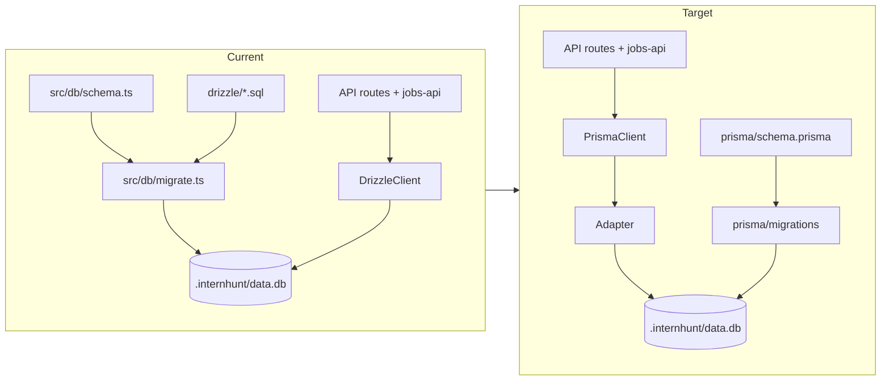

# Drizzle to Prisma 7 Migration Plan

## Scope and success criteria

**In scope:** Remove Drizzle entirely ([`drizzle.config.ts`](drizzle.config.ts), [`drizzle/`](drizzle/), [`src/db/schema.ts`](src/db/schema.ts), [`src/db/migrate.ts`](src/db/migrate.ts)), introduce Prisma 7 with `@prisma/adapter-better-sqlite3`, rewrite all DB access in **9 files**, update docs/scripts.

**Success criteria:**
- `prisma/schema.prisma` matches the **final** state of [`src/db/schema.ts`](src/db/schema.ts) (post-migration `0003`), not the obsolete intermediate shapes in early Drizzle SQL (e.g. `saved_jobs.job_id`, `jobs_url_unique`).
- Existing dev DBs at [`.internhunt/data.db`](.internhunt/data.db) open without data loss.
- `npm run build` and manual API smoke tests pass (jobs scrape, resume upload, chat, save/apply).



---

## Current inventory

| Area | Location | Notes |
|------|----------|-------|
| Schema source of truth | [`src/db/schema.ts`](src/db/schema.ts) | 12 tables + relations; timestamps as **integer ms**; booleans as **0/1 integer** |
| Client + pragmas | [`src/db/index.ts`](src/db/index.ts) | `better-sqlite3`, WAL, `foreign_keys=ON`, auto-runs migrations |
| Custom migrator | [`src/db/migrate.ts`](src/db/migrate.ts) | Tracks `__migrations` table; applies 4 SQL files in order |
| Drizzle Kit config | [`drizzle.config.ts`](drizzle.config.ts) | SQLite → `./.internhunt/data.db` |
| Historical SQL | [`drizzle/`](drizzle/) | 4 migrations; **0003** is the breaking reshape (saved_jobs redesign, `jobs.user_id`, `applied_jobs`) |
| Consumers | 9 TS files | Mix of `db.query.*` (relational API) and `db.insert/update/delete` |

**Query patterns to translate:**

| Drizzle | Prisma 7 |
|---------|----------|
| `db.query.X.findFirst({ where, orderBy })` | `prisma.x.findFirst({ where, orderBy })` |
| `db.query.X.findMany({ where, orderBy })` | `prisma.x.findMany(...)` |
| `db.insert(X).values({...})` | `prisma.x.create({ data })` |
| `db.update(X).set({...}).where(...)` | `prisma.x.update({ where, data })` |
| `db.delete(X).where(...)` | `prisma.x.deleteMany({ where })` |
| `db.delete(X)` (no where) | `prisma.x.deleteMany()` |
| `.onConflictDoUpdate({ target: jobs.id, set })` | `prisma.job.upsert({ where: { id }, create, update })` |
| `lt(col, date)` | `{ col: { lt: date } }` |
| `inArray(col, ids)` | `{ col: { in: ids } }` |
| `typeof jobs.$inferSelect` | `Job` from `@/generated/prisma` (or chosen output path) |

**Heavy usage:** [`src/lib/jobs-api.ts`](src/lib/jobs-api.ts) (upsert, bulk delete, relational finds, `$inferSelect` types).

---

## Phase 1 — Dependencies and Prisma 7 scaffolding

### 1.1 Packages

**Add:**
- `prisma` (dev)
- `@prisma/client`
- `@prisma/adapter-better-sqlite3`
- Keep `better-sqlite3` (already present; [`scripts/rebuild-sqlite.js`](scripts/rebuild-sqlite.js) stays)

**Remove:**
- `drizzle-orm`, `drizzle-kit`

### 1.2 Config files

**Create `prisma/schema.prisma`** (generator + datasource per Prisma 7 SQLite skill):

```prisma
generator client {
  provider = "prisma-client-js"
  output   = "../src/generated/prisma"
}

datasource db {
  provider = "sqlite"
  url      = env("DATABASE_URL")
}
```

**Create `prisma.config.ts`** at repo root:

```ts
import { defineConfig } from "prisma/config";

export default defineConfig({
  schema: "prisma/schema.prisma",
  datasource: { url: process.env.DATABASE_URL },
});
```

**Add to `.env.local` / `.env.example`:**

```env
DATABASE_URL="file:./.internhunt/data.db"
```

(Path is relative to project root, matching [`drizzle.config.ts`](drizzle.config.ts).)

**`package.json` scripts:**

```json
"db:generate": "prisma generate",
"db:migrate": "prisma migrate dev",
"db:migrate:deploy": "prisma migrate deploy",
"db:studio": "prisma studio",
"postinstall": "node scripts/rebuild-sqlite.js && prisma generate"
```

### 1.3 Next.js bundling

Update [`next.config.ts`](next.config.ts) `serverExternalPackages`:
- Remove `drizzle-orm/better-sqlite3`
- Add `@prisma/client`, `@prisma/adapter-better-sqlite3`, `better-sqlite3`, and generated client path if needed

Keep `require()` pattern in [`src/db/index.ts`](src/db/index.ts) for native module compatibility with Turbopack (same rationale as today).

---

## Phase 2 — `prisma/schema.prisma` (complete match)

Use **`@@map` / `@map`** so Prisma model names are PascalCase while **physical** SQLite names stay identical to Drizzle migrations.

**Global conventions (must match Drizzle SQLite storage):**
- Timestamps: `DateTime` with `@db.Integer` **or** `BigInt` mapped to integer columns storing **Unix ms** (verify with `prisma db pull` on a live DB; prefer matching existing integer ms, not ISO strings).
- Booleans: `Boolean` (SQLite 0/1) for `email_verified`, `is_active`.
- JSON blobs: stay `String` (`skills`, `metadata`, `snapshot`, etc.) — app keeps `JSON.parse`/`stringify`.
- `onDelete: Cascade` on all FKs matching Drizzle `references(..., { onDelete: "cascade" })`.
- Drizzle `$onUpdate(() => new Date())` has **no Prisma DB equivalent** — set `updatedAt: new Date()` in any future `update` on auth tables (currently unused in app code).

### 2.1 Table-by-table mapping

| Model | `@@map` | Key fields / constraints |
|-------|---------|---------------------------|
| `User` | `user` | `id` PK; `email` `@unique`; `emailVerified` → `email_verified` default false; `createdAt`/`updatedAt` with `@default(dbgenerated("(cast(unixepoch('subsecond') * 1000 as integer))"))` where Drizzle has SQL default |
| `Session` | `session` | `token` `@unique`; `@@index([userId], map: "session_userId_idx")` |
| `Account` | `account` | `@@index([userId], map: "account_userId_idx")` |
| `Verification` | `verification` | `@@index([identifier], map: "verification_identifier_idx")` |
| `Resume` | `resumes` | defaults `"[]"` / `"{}"` on JSON text cols; `@@index([userId], map: "resumes_userId_idx")` |
| `Job` | `jobs` | **`userId` optional** (`user_id` nullable per schema); **no** `@@unique([url])` (dropped after 0003 reshape; not in current Drizzle schema); indexes: `jobs_userId_idx`, `jobs_source_idx`, `jobs_company_idx` |
| `JobMatch` | `job_matches` | composite FKs to user, job, resume; indexes on `userId`, `jobId` |
| `SavedJob` | `saved_jobs` | `jobExternalId` → `job_external_id`; `@@unique([userId, jobExternalId], map: "saved_jobs_user_job_idx")`; `@@index([userId], map: "saved_jobs_userId_idx")` |
| `AppliedJob` | `applied_jobs` | same composite unique pattern as saved |
| `CoverLetter` | `cover_letters` | `tone` default `"professional"` |
| `ChatMessage` | `chat_messages` | |
| `ScrapeRun` | `scrape_runs` | no relations |

### 2.2 Relations (both sides)

Mirror Drizzle `relations()` from [`src/db/schema.ts`](src/db/schema.ts) lines 210–264, e.g.:

```prisma
model User {
  // ...
  sessions     Session[]
  accounts     Account[]
  resumes      Resume[]
  jobs         Job[]
  jobMatches   JobMatch[]
  savedJobs    SavedJob[]
  appliedJobs  AppliedJob[]
  coverLetters CoverLetter[]
  chatMessages ChatMessage[]
}
```

### 2.3 Schema validation workflow

1. Hand-author `prisma/schema.prisma` from [`src/db/schema.ts`](src/db/schema.ts).
2. Apply all Drizzle migrations to a **fresh** copy of DB (or use existing dev DB).
3. Run `npx prisma db pull` and **diff** pulled schema vs hand-written — reconcile until identical on names, nullability, defaults, indexes.
4. `npx prisma validate`.

**Known legacy drift (optional cleanup migration):** DBs created before `0003` may still have `jobs_url_unique`. Current app schema does **not** include it. Add `DROP INDEX IF EXISTS jobs_url_unique;` to baseline SQL only if `db pull` shows it on your dev DB.

---

## Phase 3 — Migrations (replace Drizzle SQL)

### 3.1 Baselining strategy (preserve existing data)

Do **not** replay Drizzle’s destructive `0003` DELETEs on production/dev DBs that already ran them.

**Steps:**
1. Generate SQL for empty → final schema:
   ```bash
   npx prisma migrate diff \
     --from-empty \
     --to-schema-datamodel prisma/schema.prisma \
     --script > prisma/migrations/YYYYMMDDHHMMSS_init/migration.sql
   ```
2. Review SQL side-by-side with cumulative end state of:
   - [`drizzle/20260304073146_eminent_electro.sql`](drizzle/20260304073146_eminent_electro.sql)
   - [`drizzle/20260304163519_lively_polaris.sql`](drizzle/20260304163519_lively_polaris.sql)
   - [`drizzle/0002_robust_mulholland_black.sql`](drizzle/0002_robust_mulholland_black.sql)
   - [`drizzle/0003_job_cache_and_user_refs.sql`](drizzle/0003_job_cache_and_user_refs.sql)
3. For **existing** databases that already have tables:
   ```bash
   npx prisma migrate resolve --applied YYYYMMDDHHMMSS_init
   ```
4. For **fresh** clones: `npx prisma migrate deploy` creates schema from init migration.

### 3.2 Runtime migrations (replace `runMigrations`)

Remove [`src/db/migrate.ts`](src/db/migrate.ts) and `__migrations` table usage.

In [`src/db/index.ts`](src/db/index.ts), after creating Prisma client, run **once per process** in development (optional in production for local SQLite app):

```ts
import { execSync } from "child_process";
// or spawn prisma migrate deploy programmatically via CLI in CI only
```

**Recommended:** call `prisma migrate deploy` from `npm run dev` pre-script or document `db:migrate:deploy` in README; avoid blocking Next hot reload with sync exec unless guarded by `globalThis.__prismaMigrated`.

Leave legacy `__migrations` table in SQLite harmlessly, or drop in a one-off SQL note.

### 3.3 Delete Drizzle artifacts

Remove after Prisma baseline verified:
- [`drizzle/`](drizzle/) (entire folder including `meta/`)
- [`drizzle.config.ts`](drizzle.config.ts)
- [`src/db/schema.ts`](src/db/schema.ts)
- [`src/db/migrate.ts`](src/db/migrate.ts)

---

## Phase 4 — Prisma client singleton

Replace [`src/db/index.ts`](src/db/index.ts) with Prisma 7 + adapter (preserve dirs + pragmas):

```ts
// Pseudocode — implement with require() for better-sqlite3
const sqlite = new Database(DB_PATH);
sqlite.pragma("journal_mode = WAL");
sqlite.pragma("foreign_keys = ON");

const adapter = new PrismaBetterSqlite3(sqlite);
export const prisma = globalForPrisma.prisma ?? new PrismaClient({ adapter });
if (process.env.NODE_ENV !== "production") globalForPrisma.prisma = prisma;

export { RESUMES_DIR, ensureUserResumeDir }; // unchanged
```

**Export naming:** Either export `prisma` and update all imports, or `export const db = prisma` temporarily to minimize diff (team preference: **`prisma`** for clarity).

Update path alias usage: `import { prisma } from "@/db"` (file stays [`src/db/index.ts`](src/db/index.ts)).

Run `prisma generate` → import types from `@/generated/prisma`.

---

## Phase 5 — Rewrite consumers (file-by-file)

Replace `import { db } from "@/db"` + `@/db/schema` + `drizzle-orm` with `import { prisma } from "@/db"` + generated types.

| File | Changes |
|------|---------|
| [`src/lib/dev-user.server.ts`](src/lib/dev-user.server.ts) | `findFirst` → `prisma.user.findFirst`; `create` for dev user |
| [`src/lib/jobs-api.ts`](src/lib/jobs-api.ts) | Largest rewrite: all `db.query` → `prisma.*`; `purgeAllJobCache` → `deleteMany`; `replaceUserJobCache` → loop `upsert`; replace `$inferSelect` with `Job`, `JobMatch`, etc.; `cacheRowToSnapshot(row: Job)` |
| [`src/app/api/jobs/route.ts`](src/app/api/jobs/route.ts) | `prisma.resume.findFirst` |
| [`src/app/api/jobs/scrape/route.ts`](src/app/api/jobs/scrape/route.ts) | scrape run CRUD + resume find |
| [`src/app/api/jobs/[id]/save/route.ts`](src/app/api/jobs/[id]/save/route.ts) | saved job toggle |
| [`src/app/api/jobs/[id]/apply/route.ts`](src/app/api/jobs/[id]/apply/route.ts) | applied job toggle |
| [`src/app/api/resume/route.ts`](src/app/api/resume/route.ts) | `parseResume(row: Resume)` |
| [`src/app/api/resume/upload/route.ts`](src/app/api/resume/upload/route.ts) | insert/update resume; remove dynamic `drizzle-orm` import (~line 807); use `prisma` throughout background matcher |
| [`src/app/api/chat/route.ts`](src/app/api/chat/route.ts) | message list/create/delete |
| [`src/app/api/cover/generate/route.ts`](src/app/api/cover/generate/route.ts) | cover letter + resume queries |

**Example conversions:**

```ts
// Drizzle
await db.query.resumes.findFirst({
  where: and(eq(resumes.userId, userId), eq(resumes.isActive, true)),
  orderBy: (r, { desc }) => [desc(r.uploadedAt)],
});

// Prisma
await prisma.resume.findFirst({
  where: { userId, isActive: true },
  orderBy: { uploadedAt: "desc" },
});
```

```ts
// Drizzle upsert (jobs-api)
await db.insert(jobs).values(row).onConflictDoUpdate({ target: jobs.id, set: { ... } });

// Prisma
await prisma.job.upsert({
  where: { id: row.id },
  create: row,
  update: { /* same fields as set */ },
});
```

---

## Phase 6 — Documentation and DX

Update [`README.md`](README.md):
- Tech stack: **SQLite + Prisma 7**
- Replace `npx drizzle-kit push` with `npx prisma migrate deploy` (and `db:migrate` for dev)
- Project tree: `prisma/schema.prisma` instead of `src/db/schema.ts`

Add short **`docs/database.md`** (optional): migration workflow, `DATABASE_URL`, Studio command, note that Better Auth tables exist for future [`README`](README.md) Better Auth integration (no adapter wired yet).

---

## Phase 7 — Verification checklist

1. **Schema parity:** `prisma migrate diff --from-schema-datasource prisma/schema.prisma --to-url "$DATABASE_URL"` → empty or expected-only drift.
2. **Generate:** `npm run db:generate` succeeds.
3. **Fresh DB:** delete `.internhunt/data.db` → start app → `migrate deploy` → tables + indexes exist.
4. **Existing DB:** with data → `migrate resolve` baseline → app reads resumes/jobs.
5. **API smoke tests:**
   - `GET/POST /api/resume`, upload PDF
   - `POST /api/jobs/scrape`, `GET /api/jobs`
   - Save/apply job toggles
   - `POST /api/chat`, `POST /api/cover/generate`
6. **Build:** `npm run build` (note: project has `ignoreBuildErrors: true` — still run `tsc` or fix new type errors in touched files).
7. **Grep guard:** no remaining `drizzle` imports in `src/`.

---

## Risk register

| Risk | Mitigation |
|------|------------|
| Timestamp type mismatch (integer ms vs DateTime) | Validate with `db pull`; add integration test reading one row |
| Prisma 7 adapter + Turbopack | Keep `require()` + `serverExternalPackages`; test `next dev` and `next build` |
| Accidental replay of 0003 DELETEs | Baseline + `migrate resolve` on existing DBs only |
| `purgeAllJobCache` deletes **all** users’ jobs | Preserve behavior (`deleteMany` without `where`) — document as intentional |
| Future Better Auth | Prisma has official Better Auth adapter; tables already match Better Auth shape — wire separately post-migration |

---

## Execution order (recommended)

1. Add Prisma deps + config + `schema.prisma` (no Drizzle removal yet).
2. Generate client; implement new [`src/db/index.ts`](src/db/index.ts) alongside old (feature flag optional) OR branch migration.
3. Create + validate init migration; baseline existing DB.
4. Rewrite [`src/lib/jobs-api.ts`](src/lib/jobs-api.ts) first (types + upsert), then API routes.
5. Remove Drizzle packages/files; update README/scripts.
6. Full verification checklist.
