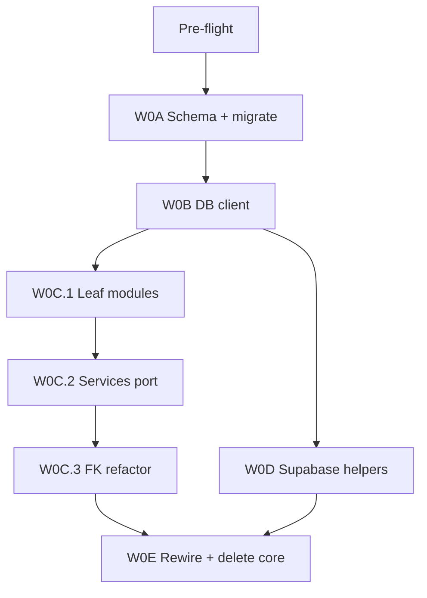

# Wave 0A–0E: One database, one codebase (expanded)

Aligns with [docs/MASTER_BUILD_PLAN.md](../../Desktop/MyCode/Intern-Job-Ai-assistant-github-proj/docs/MASTER_BUILD_PLAN.md) §3.

**Out of scope for Wave 0:** Supabase Auth UI (Wave 1), removing `ensureDevUser` (Wave 1), Application Hub E2E (Waves 3–4), Storage RLS policies (Wave 2).

**End state after Wave 0:** Single Postgres DB; all domain logic in `src/lib/`; no `core/` folder; no `@guavajobs/core` imports; app may still use **interim** dev-user auth until Wave 1 (see §Interim runtime).

---

## 0. Pre-flight (before W0A)

| ID | Task | Done when |
|----|------|-----------|
| PF.1 | Confirm `.env.local` has `DATABASE_URL` (pooler, `?pgbouncer=true`), `DIRECT_URL` (port 5432), Supabase public keys, `SUPABASE_SERVICE_ROLE_KEY` | Vars load in shell |
| PF.2 | Confirm Supabase project DB is **empty** or you accept wiping it (stakeholder: fresh start) | No production data at risk |
| PF.3 | Optional: zip/copy `.internhunt/data.db` if you want SQLite data reference | Backup only |
| PF.4 | Read [core/src/services/index.ts](../../Desktop/MyCode/Intern-Job-Ai-assistant-github-proj/core/src/services/index.ts) — list every symbol consumers import from `@guavajobs/core` | Export checklist §Export matrix |
| PF.5 | Run baseline: `rg '@guavajobs/core' src --files-with-matches \| wc -l` → expect **34** | Record count |

---

## 1. Execution order and gates



| Wave | Goal | Must pass before next |
|------|------|------------------------|
| **0A** | Merged Postgres schema deployed to Supabase | `prisma migrate status` |
| **0B** | Runtime `prisma` uses `DATABASE_URL` | No sqlite imports in `src/db` |
| **0C** | Domain logic in `src/lib/` (ported, not wired) | `rg getDb\|@guavajobs/core` clean under `src/lib` |
| **0D** | Supabase admin + server stub for compile | Admin smoke test |
| **0E** | All consumers rewired; `core/` deleted | `rg '@guavajobs/core' src` = 0; build |

**Recommended PRs:** PR1 = 0A+0B · PR2 = 0C+0D · PR3 = 0E (or one PR if solo).

---

## 2. Locked decisions (reference)

| Topic | Decision |
|-------|----------|
| Database | Postgres on Supabase; **fresh** migration chain |
| Auth (product) | Supabase only; always sign-in — **Wave 1** |
| Auth (Wave 0 interim) | Legacy APIs may still call `ensureDevUser` until Wave 1; Application routes use `getSession` stub → `null` (401/redirect) |
| `User.id` | UUID = Supabase `auth.users.id` |
| Service role | Available — use for Storage admin in 0D |
| Application FKs | `Application.coverLetterId` 1:1; `Application.resumeId` optional |
| Jobs | Keep [jobs-api.ts](../../Desktop/MyCode/Intern-Job-Ai-assistant-github-proj/src/lib/jobs-api.ts); skip `core/services/jobs` |
| Legacy timestamps | Keep `Int` ms on Resume/Job/etc. in Wave 0 to limit churn |

---

## 3. Interim runtime (after Wave 0, before Wave 1)

Expect this **temporary** behaviour — document so QA is not surprised:

| Area | Wave 0 behaviour |
|------|----------------|
| `/api/jobs`, `/api/resume`, `/api/chat`, `/api/cover` | Still use `requireAuth` → `ensureDevUser` (dev user row in Postgres) |
| `/api/applications`, dashboard applications pages | `getSession()` returns `null` → **401** or redirect to `/sign-in` (page may not exist yet) |
| Profile server actions | Compile if `supabase/server.ts` stub exists; upload may fail without buckets |
| Application Hub | **Not manually testable** until Wave 1 auth + Wave 3 wiring |

Wave 0 success = **architecture migration**, not full product QA.

---

## 4. Wave 0A — Postgres schema

### 4.1 Archive SQLite migrations

| ID | Action |
|----|--------|
| A.1 | Move `prisma/migrations/20250603220000_init` and `20250603220100_legacy_cleanup` → `prisma/migrations/_sqlite_archive/` |
| A.2 | Set `prisma/migrations/migration_lock.toml` → `provider = "postgresql"` |
| A.3 | Remove `db:baseline` script from [package.json](../../Desktop/MyCode/Intern-Job-Ai-assistant-github-proj/package.json) (SQLite-specific) |

### 4.2 Model-by-model merge checklist

Use [core/prisma/schema.prisma](../../Desktop/MyCode/Intern-Job-Ai-assistant-github-proj/core/prisma/schema.prisma) + [prisma/schema.prisma](../../Desktop/MyCode/Intern-Job-Ai-assistant-github-proj/prisma/schema.prisma).

| Model | Action |
|-------|--------|
| `User` | **Replace** both definitions. `id String @id @db.Uuid` (no `@default(uuid())` on id — set from Supabase). Fields: `email`, `displayName`, `tier`, AI usage, `createdAt`/`updatedAt` DateTime. Table `@@map("users")`. |
| `Session`, `Account`, `Verification` | **Delete** |
| `Profile` | **Add** from core (full field set) |
| `Application` | **Add** from core + add `resumeId`, `coverLetterId` FKs; remove `coverLetters CoverLetter[]` relation |
| `ApplicationCoverLetter` | **Add** (rename from core `CoverLetter`). Fields: `content`, `source`, `citationsJson`, `isUserEdited Boolean @default(false)`, timestamps. **No** `applicationId` column — link via `Application.coverLetterId` |
| `ApplicationNote`, `ApplicationProfileSnapshot` | **Add** from core |
| `SavedJobSearch` | **Add** from core |
| `Resume` | **Keep** InternHunt fields; `userId` → `@db.Uuid`; add `applications Application[]`; Int timestamps |
| `Job`, `JobMatch`, `SavedJob`, `AppliedJob`, `ChatMessage`, `ScrapeRun` | **Keep** InternHunt; `userId` UUID where applicable; Int timestamps; String JSON columns unchanged |
| `CoverLetter` (job+resume) | **Rename** → `LegacyCoverLetter` → `@@map("legacy_cover_letters")` |
| `JobListingCache`, `JobSearchCache` | **Omit** (defer) |

**Prisma relation for 1:1 letter (important):**

```prisma
model Application {
  coverLetterId String? @unique @db.Uuid
  coverLetter   ApplicationCoverLetter? @relation(fields: [coverLetterId], references: [id])
}

model ApplicationCoverLetter {
  id          String @id @default(uuid()) @db.Uuid
  application Application?
  // fields...
}
```

**`@@unique([userId, jobExternalId])` on Application:** ensure `jobExternalId` nullability matches core (multiple manual apps without external id may need partial unique index — if migrate fails, use core’s exact constraint).

### 4.3 Datasource and Prisma 7 config

**[prisma/schema.prisma](../../Desktop/MyCode/Intern-Job-Ai-assistant-github-proj/prisma/schema.prisma):**

```prisma
datasource db {
  provider  = "postgresql"
  url       = env("DATABASE_URL")
  directUrl = env("DIRECT_URL")
}
```

**[prisma.config.ts](../../Desktop/MyCode/Intern-Job-Ai-assistant-github-proj/prisma.config.ts):** replace `INTERNHUNT_DATABASE_URL` with `env("DATABASE_URL")`. If Prisma 7 supports `directUrl` in config object, add it; otherwise schema `directUrl` is sufficient for CLI.

| ID | Action |
|----|--------|
| A.4 | Update `prisma.config.ts` datasource url |
| A.5 | `npx prisma validate` |
| A.6 | `npx prisma migrate dev --name init_postgres` (uses `DIRECT_URL` from env) |
| A.7 | `npx prisma generate` |

### 4.4 Post-migrate schema smoke

| ID | Action |
|----|--------|
| A.8 | `npx prisma studio` — spot-check `users`, `applications`, `application_cover_letters` |
| A.9 | Confirm enum types exist in DB (`ApplicationStatus`, etc.) |

**Verify 0A**

```bash
npx prisma migrate status
rg 'provider = "sqlite"' prisma/
rg 'INTERNHUNT_DATABASE' prisma.config.ts
```

---

## 5. Wave 0B — Prisma client runtime

| ID | Task | File |
|----|------|------|
| B.1 | Replace [src/db/index.ts](../../Desktop/MyCode/Intern-Job-Ai-assistant-github-proj/src/db/index.ts) with Postgres singleton (pattern: [core/src/db/client.ts](../../Desktop/MyCode/Intern-Job-Ai-assistant-github-proj/core/src/db/client.ts)) | `src/db/index.ts` |
| B.2 | Delete or archive [src/db/ensure-prisma-migrated.ts](../../Desktop/MyCode/Intern-Job-Ai-assistant-github-proj/src/db/ensure-prisma-migrated.ts) | |
| B.3 | Keep `export const RESUMES_DIR` for local fallback | `src/db/index.ts` |
| B.4 | Remove sqlite from [next.config.ts](../../Desktop/MyCode/Intern-Job-Ai-assistant-github-proj/next.config.ts) `serverExternalPackages` | |
| B.5 | Remove deps: `better-sqlite3`, `@prisma/adapter-better-sqlite3`, `@types/better-sqlite3` | `package.json` |
| B.6 | `postinstall`: `"prisma generate"` only; remove `scripts/rebuild-sqlite.js` usage | |
| B.7 | Add `@supabase/supabase-js` if missing (for 0D) | |
| B.8 | Remove `INTERNHUNT_DATABASE_URL` from `.env.local` | manual |

**Verify 0B**

```bash
rg 'better-sqlite3|INTERNHUNT_DATABASE|PrismaBetterSqlite3' src prisma.config.ts package.json
# Quick DB ping (after generate):
npx tsx -e "import { prisma } from './src/db'; prisma.\$queryRaw\`SELECT 1\`.then(() => console.log('ok')).finally(() => prisma.\$disconnect())"
```

---

## 6. Wave 0C — Port `core/` → `src/lib/`

**Prerequisite:** 0A.7 + 0B.1.

### 6.1 Order of port (reduces broken intermediate state)

1. Validators + API + types (no Prisma)
2. Application helpers (constants, snapshots, taxonomy, row-styles alignment)
3. `users/ensure-user`, `profile/service`, `saved-searches`
4. `applications/cover-letter/` (before applications service)
5. `applications/service.ts` (FK refactor)
6. `ai/` + merge with [llm.ts](../../Desktop/MyCode/Intern-Job-Ai-assistant-github-proj/src/lib/llm.ts)

### 6.2 Leaf modules (C.1)

| ID | From | To |
|----|------|-----|
| C.1.1 | `core/src/validators/*` | `src/lib/validators/` |
| C.1.2 | `core/src/api/*` | `src/lib/api/` — split files: `errors.ts`, `response.ts`, `with-error-handler.ts`, `handle-service-error.ts`, `version.ts` |
| C.1.3 | `core/src/types/index.ts` | `src/lib/types/index.ts` |
| C.1.4 | `applications/constants`, `snapshots`, `job-taxonomy`, `profile-prompt` | `src/lib/applications/` |
| C.1.5 | `profile/career-preferences.ts` | `src/lib/profile/career-preferences.ts` |

**Zod 4 fixes (common breaks):**

- `z.record(z.string(), z.unknown())` explicit key schema
- `.merge()` / `.extend()` on objects — check Zod 4 API
- Export `ExperienceEntry`, `EducationEntry` from validators or types for profile components

### 6.3 Cover letter service FK refactor (C.2 — critical)

Core [cover-letters.ts](../../Desktop/MyCode/Intern-Job-Ai-assistant-github-proj/core/src/services/cover-letters.ts) uses `db.coverLetter.findUnique({ where: { applicationId } })`.

**Replace with:**

| Old pattern | New pattern |
|-------------|-------------|
| `findUnique({ where: { applicationId } })` | `application.findUnique({ where: { id }, include: { coverLetter: true } })` |
| `coverLetter.create({ data: { applicationId, ... } })` | `letter = await tx.applicationCoverLetter.create({ data: {...} }); await tx.application.update({ where: { id: applicationId }, data: { coverLetterId: letter.id } })` |
| `coverLetter.update` | Update via `application.coverLetterId` → letter id |
| `listForApplication` | Return `application.coverLetter ? [dto] : []` (API compat) |

Apply same rules in:

- `src/lib/applications/cover-letter/generate.ts`
- `src/lib/applications/cover-letter/generate-route.ts`
- Any `previewCoverLetterContent` callers

Add **`isUserEdited`** flag on manual save paths (schema + update data).

### 6.4 Applications service FK refactor (C.3)

Grep targets in ported [applications/service.ts](../../Desktop/MyCode/Intern-Job-Ai-assistant-github-proj/core/src/services/applications.ts):

- `coverLetters` → `coverLetter`
- `row.coverLetters[0]` → `row.coverLetter`
- `include: { coverLetters: ... }` → `include: { coverLetter: true }`
- Bundle types: `hasCoverLetter` from `!!application.coverLetterId`

**resumeId:** add helpers `setApplicationResume(applicationId, resumeId)` used later by Wave 3; optional no-op in list/detail for 0C.

### 6.5 Services port map (C.4)

| ID | Source | Destination |
|----|--------|-------------|
| C.4.1 | `services/users.ts` | `src/lib/users/ensure-user.ts` — upsert `User` with `id`, `email`, `displayName` (map `name` → `displayName` for dev bridge in 0E) |
| C.4.2 | `services/profile.ts` | `src/lib/profile/service.ts` |
| C.4.3 | `services/profile-url-import/**` | `src/lib/profile/url-import/` |
| C.4.4 | `services/saved-job-searches.ts` | `src/lib/jobs/saved-searches.ts` |
| C.4.5 | `services/applications.ts` + errors | `src/lib/applications/service.ts` |
| C.4.6 | `services/cover-letters/**` | `src/lib/applications/cover-letter/` |
| C.4.7 | `services/ai/**`, `usage.ts` | `src/lib/ai/` |

**Mechanical:** `getDb()` → `prisma` from `@/db`; prisma imports from `@/generated/prisma`.

**Skip:** entire `core/src/services/jobs/**`.

### 6.6 AI merge (C.5)

| ID | Action |
|----|--------|
| C.5.1 | Port `cover-letter-prompt.ts`, `profile-readiness.ts` |
| C.5.2 | Delete ported `openai-client.ts` usage — call [llm.ts](../../Desktop/MyCode/Intern-Job-Ai-assistant-github-proj/src/lib/llm.ts) `completeChat` (or equivalent) |
| C.5.3 | Ensure `OPENAI_API_KEY` / OpenRouter headers match existing app |

### 6.7 Barrel exports (C.6 — strongly recommended for 0E)

Create [src/lib/applications/index.ts](../../Desktop/MyCode/Intern-Job-Ai-assistant-github-proj/src/lib/applications/index.ts) re-exporting:

- `applicationsService`, `ApplicationsServiceError`
- `PIPELINE_STATUS_OPTIONS`, `PIPELINE_APPLICATION_STATUSES`, `STAGE_ORDER`, `formatApplicationStatusLabel`
- `getApplicationRowClass` from `./row-styles`
- Types: `ApplicationListItem`, `ApplicationBundle`, etc.

Create `src/lib/profile/index.ts` for `profileService`, `ProfileDto`, `computeCompleteness`, etc.

### 6.8 row-styles vs Prisma enums

[src/lib/applications/row-styles.ts](../../Desktop/MyCode/Intern-Job-Ai-assistant-github-proj/src/lib/applications/row-styles.ts) uses string union types. After generate, either:

- Import `ApplicationStatus` from `@/generated/prisma`, or
- Keep string unions but ensure they match enum values exactly

**Verify 0C**

```bash
rg '@guavajobs/core|getDb\(' src/lib
rg 'applicationId' src/lib/applications/cover-letter src/lib/applications/service.ts
# applicationId on letter model should be gone; only coverLetterId on Application
```

---

## 7. Wave 0D — Supabase helpers

| ID | File | Purpose |
|----|------|---------|
| D.1 | `src/lib/supabase/env.ts` | `isSupabaseConfigured()` |
| D.2 | `src/lib/supabase/admin.ts` | `createSupabaseAdmin()` — URL from `NEXT_PUBLIC_SUPABASE_URL`, key from `SUPABASE_SERVICE_ROLE_KEY` |
| D.3 | `src/lib/supabase/server.ts` | `createServerSupabaseClient()` — **Wave 0 stub:** can wrap admin for server actions ONLY if documented as interim; **Wave 1** replaces with `@supabase/ssr` + user JWT |
| D.4 | `scripts/smoke-supabase-admin.ts` (optional) | Assert admin client creates without throw |

**Storage checklist (manual, Supabase dashboard):**

| Bucket | Purpose |
|--------|---------|
| `cv-uploads` | Profile CV ([profile/actions.ts](../../Desktop/MyCode/Intern-Job-Ai-assistant-github-proj/src/lib/profile/actions.ts) uses `CV_BUCKET = "cv-uploads"`) |
| `resumes` | Resume PDFs (optional Wave 2) |

**Verify 0D**

- Run smoke script with `.env.local` loaded
- Do not require buckets to exist for Wave 0 completion

---

## 8. Wave 0E — Rewire consumers + delete `core/`

### 8.1 Compile stubs (E.0)

| ID | File | Behaviour |
|----|------|-----------|
| E.0.1 | `src/lib/auth/get-session.ts` | `export async function getSession() { return null }` + JSDoc "Wave 1: Supabase Auth" |
| E.0.2 | Ensure `src/lib/api/handle-service-error.ts` exports match import paths in API routes |

### 8.2 Export matrix (`@guavajobs/core` → new paths)

Every symbol imported in `src/` must resolve. Common mappings:

| Symbol | New import path |
|--------|-----------------|
| `applicationsService` | `@/lib/applications/service` or `@/lib/applications` |
| `ApplicationsServiceError` | `@/lib/applications/service` |
| `coverLettersService` | `@/lib/applications/cover-letter` (or service barrel) |
| `profileService`, `ProfileDto`, `computeCompleteness`, `ProfileCompleteness` | `@/lib/profile/service` |
| `usersService` | `@/lib/users/ensure-user` as `usersService` object |
| `savedJobSearchesService` | `@/lib/jobs/saved-searches` |
| `generateForApplication`, `generateCoverLetterFromBody` | `@/lib/applications/cover-letter/generate` |
| `ApiErrorCode` | `@/lib/api/errors` |
| `jsonSuccess`, `jsonError` | `@/lib/api/response` |
| `withErrorHandler`, `handleServiceError` | `@/lib/api/with-error-handler`, `@/lib/api/handle-service-error` |
| `PIPELINE_STATUS_OPTIONS`, `getApplicationRowClass`, taxonomy helpers | `@/lib/applications` |
| `ExperienceEntry`, `EducationEntry`, `ProfileQuiz`, etc. | `@/lib/types` or `@/lib/validators/profile` |
| `isDatabaseConfigured`, `getDb` (health) | remove; use `prisma.$queryRaw` |
| Profile URL import | `@/lib/profile/url-import` |

**Do not port:** `jobsService`, `JUNIOR_DEFAULT_WHAT`, `billingService`.

### 8.3 Rewire by batch (E.1)

| Batch | Files (count) | ID |
|-------|---------------|-----|
| API applications + notes + cover-letters | 6 routes | E.1a |
| API saved-searches + profile/parse-url + health | 4 routes | E.1b |
| `src/lib/applications/*` | 5 files | E.1c |
| `src/lib/profile/*` | 2 files | E.1d |
| `src/components/applications/*` | 8 files | E.1e |
| `src/components/profile/*` | 9 files | E.1f |
| `src/components/dashboard/*` | 4 files | E.1g |
| Dashboard application pages | 3 pages | E.1h |

After each batch: `rg '@guavajobs/core' <batch-path>` → 0.

### 8.4 Legacy InternHunt on Postgres (E.2)

| File | Required changes |
|------|------------------|
| [jobs-api.ts](../../Desktop/MyCode/Intern-Job-Ai-assistant-github-proj/src/lib/jobs-api.ts) | Import `LegacyCoverLetter` if needed; `prisma.legacyCoverLetter`; `userId` must be valid UUID string; Int dates unchanged |
| [dev-user.server.ts](../../Desktop/MyCode/Intern-Job-Ai-assistant-github-proj/src/lib/dev-user.server.ts) | `prisma.user.create` → use `displayName` not `name`; drop `emailVerified` int; add `// TODO Wave 1` |
| [session.ts](../../Desktop/MyCode/Intern-Job-Ai-assistant-github-proj/src/lib/session.ts) | Keep until Wave 1 |
| [api/cover/generate/route.ts](../../Desktop/MyCode/Intern-Job-Ai-assistant-github-proj/src/app/api/cover/generate/route.ts) | `prisma.legacyCoverLetter` instead of `coverLetter` |
| [api/resume/*](../../Desktop/MyCode/Intern-Job-Ai-assistant-github-proj/src/app/api/resume/), jobs, chat | User create shape only |

**UUID for dev user:** [dev-user.ts](../../Desktop/MyCode/Intern-Job-Ai-assistant-github-proj/src/lib/dev-user.ts) `DEV_USER_ID` must be valid UUID format for Postgres `@db.Uuid` — if current id is not UUID, change to fixed test UUID in Wave 0E and document.

### 8.5 Health route (E.3)

[api/health/route.ts](../../Desktop/MyCode/Intern-Job-Ai-assistant-github-proj/src/app/api/health/route.ts):

```ts
await prisma.$queryRaw`SELECT 1`
return jsonSuccess({ ok: true, database: "postgres" })
```

### 8.6 Delete core (E.4)

| ID | Action |
|----|--------|
| E.4.1 | `rg '@guavajobs/core' .` → 0 (include docs if desired) |
| E.4.2 | `rm -rf core/` |
| E.4.3 | Remove any `core` path from `tsconfig` paths if present |

### 8.7 Verification (E.5)

| ID | Command / check |
|----|-----------------|
| E.5.1 | `rg '@guavajobs/core' src` → 0 |
| E.5.2 | `test ! -d core` |
| E.5.3 | `rg 'better-sqlite3\|INTERNHUNT_DATABASE' src prisma.config.ts package.json` |
| E.5.4 | `npm run build` |
| E.5.5 | `npx tsc --noEmit` (do not rely only on `ignoreBuildErrors: true` in next.config) |
| E.5.6 | `curl localhost:3000/api/health` after `npm run dev` → DB ok |
| E.5.7 | Optional: hit `GET /api/jobs` with dev session — proves legacy path on Postgres |

**Wave 0 complete:** E.5.1–E.5.5 all pass.

---

## 9. Export matrix (full — from core/services/index.ts)

Port or re-export these for consumers:

**applications:** `applicationsService`, `ApplicationsServiceError`, `getApplicationRowClass`, pipeline constants, taxonomy formatters, application DTO types, validator input types.

**cover letters:** `coverLettersService`, `CoverLettersServiceError`, `generateForApplication`, `generateCoverLetterForBody`, `previewCoverLetterContent`, letter DTO types.

**profile:** `profileService`, `computeCompleteness`, `isProfileReadyForAi`, `ProfileDto`, `ProfileCompleteness`.

**users:** `usersService` (`ensureUser`).

**saved searches:** `savedJobSearchesService`, `SavedJobSearchDto`.

**usage:** `usageService` (optional in 0E if nothing imports yet).

**NOT ported:** `jobsService`, `billingService`, `auth` from core, `db` from core.

---

## 10. Risk register (expanded)

| Risk | Likelihood | Impact | Mitigation |
|------|------------|--------|------------|
| FK refactor missed grep | Medium | High | Grep `coverLetters`, `applicationId` on letter, `coverLetter.findUnique` |
| `applications.ts` size (~850 LOC) | High | Medium | Port in one session; run `tsc` after |
| Dev user id not UUID | Medium | High | Fix `DEV_USER_ID` in 0E |
| Partial unique on `jobExternalId` | Low | Medium | Copy core constraint exactly |
| PgBouncer migration fail | Medium | High | Always use `DIRECT_URL` for migrate |
| `getSession` null breaks all app pages | Expected | Low until Wave 1 | Document interim state §3 |
| Admin client used for user uploads | Medium | Security | Wave 1 switch to user-scoped SSR client |
| Zod 4 subtle breaks | Medium | Medium | Run validators against sample payloads |
| Two cover letter tables confusion | Medium | Medium | Strict naming: `ApplicationCoverLetter` vs `LegacyCoverLetter` |
| Prisma 7 config mismatch | Low | High | `prisma validate` + test migrate early in 0A |

---

## 11. Rollback plan

If migration fails mid-wave:

1. **0A fails:** fix SQL in migration; reset Supabase DB (`DROP SCHEMA public CASCADE` in SQL editor) and re-run migrate — safe on empty DB only.
2. **0B–0C fails:** keep `core/` until 0E.4; do not delete until grep clean.
3. **Git:** one PR per recommended chunk enables `git revert` per PR.

---

## 12. After Wave 0 — hand off to Wave 1

Next plan section: [MASTER_BUILD_PLAN.md Wave 1](../../Desktop/MyCode/Intern-Job-Ai-assistant-github-proj/docs/MASTER_BUILD_PLAN.md) — install `@supabase/ssr`, real `getSession`, middleware, remove `ensureDevUser`.

**Do not start Wave 1 until Wave 0 verify block §8.7 passes.**

---

## 13. Improvements log (why this revision)

| Gap in prior draft | Added in this revision |
|--------------------|-------------------------|
| No pre-flight | §0 Pre-flight |
| Unclear interim auth | §3 Interim runtime |
| FK refactor underspecified | §6.3–6.4 with before/after table |
| cover-letters.ts coupling | Explicit file list + transaction pattern |
| Export list incomplete | §9 full export matrix |
| row-styles enum drift | §6.8 |
| DEV_USER_ID UUID risk | §8.4 |
| Weak verify commands | Per-wave bash + `tsc --noEmit` |
| 0D vs 0C order | Mermaid + D before E for profile compile |
| Port order within 0C | §6.1 ordered steps |
| Rollback | §11 |
| dev-user contradiction | Clarified Wave 0 vs Wave 1 in §2–3 |
