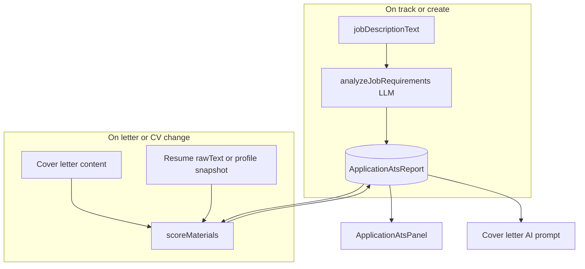

# Wave 3 — Application backend + Application ATS (Milestone B)

created_date: 2026-06-05 01:00:00, updated_at: 2026-06-05 01:00:00

**Prereqs:** Wave 1 auth, Wave 2B profile.

---

## Design decision: two ATS systems (do not merge)

| System | Scope | Where | Purpose |
|--------|--------|-------|---------|
| **Resume ATS** | User’s CV document in isolation | `/dashboard/resume`, `Resume` row | Format, sections, generic keywords — **unchanged** |
| **Application ATS** (new) | One job application | Per `Application`, detail hub | JD-specific keywords → fit for **this** role’s letter + CV |

Application ATS **reuses ideas** (keyword lists, 0–100 scores) but **not** the resume upload route or auto-profile bridge. Shared util only: `src/lib/ats/keyword-match.ts` (normalize text, present/missing keyword sets).

---

## Part A — Core Wave 3 (integration gaps)

### Current audit

| ID | Status | Action |
|----|--------|--------|
| W3.1 | Done | Verify after Part A |
| W3.2 | Mostly done | Wire AI branch on `POST .../cover-letters` |
| W3.3–W3.4 | Partial / missing | Track loop |
| W3.5–W3.8 | Partial | Redirects, resumeId, toast |
| W3.9–W3.12 | New | Application ATS (below) |

### W3.3 — [`track-job.ts`](../../src/lib/applications/track-job.ts)

- `trackJobById` **returns** `application.id` (dedup-safe).
- `trackJobAction` → `redirect(/dashboard/applications/${id}?tracked=1)`.

### W3.4 — [`dashboard/jobs/page.tsx`](../../src/app/dashboard/jobs/page.tsx)

- Per card: `<form action={trackJobAction}>` + hidden `jobId`.
- Optional later: “Track & generate letter” via `generateCoverLetterFromJobAction`.

### W3.5 — [`create-manual.ts`](../../src/lib/applications/create-manual.ts)

- Redirect to `/dashboard/applications/${application.id}?tracked=1`.

### W3.6 — [`service.ts`](../../src/lib/applications/service.ts)

- `latestActiveResumeId(userId)` on create when `resumeId` omitted.

### W3.7 — Cover letter

- Detail: `regenerateCoverLetterAction` (already works).
- API: `POST cover-letters` — if body has `content` → `upsertLetter`; else `coverLetterGenerateSchema` → `generateCoverLetterForBody`.
- **Enrichment (Part B):** pass Application ATS keyword context into [`buildCoverLetterUserPrompt`](../../src/lib/ai/cover-letter-prompt.ts).

### W3.8 — [`tracked-toast.tsx`](../../src/components/dashboard/tracked-toast.tsx)

- Mount on applications **list + detail**.
- All create/track flows use `?tracked=1` on applications routes only.

---

## Part B — Application ATS (W3.9–W3.12)

### End result (what the user sees)

On **application detail** (`/dashboard/applications/[id]`):

1. **Application strength** — single 0–100 score (e.g. “Application fit: 72%”) with label Weak / Fair / Strong.
2. **Split scores** — Cover letter vs CV (when resume linked or profile snapshot used as CV proxy).
3. **Keyword panel** — Required/preferred terms from the **job post**; chips for **present** vs **missing** in letter and CV separately.
4. **Guidance** — 2–4 actionable tips (“Add ‘Kubernetes’ to your letter intro”, “Your CV mentions React but not TypeScript from the JD”).
5. **Live updates** — After generating or editing the cover letter, saving letter text, or linking a resume, scores refresh (debounced server recompute).

On **cover letter generation** — AI prompt includes top missing keywords + role requirements so the first draft targets the JD (without exposing raw prompt in UI).

On **applications list** (Wave 4) — optional compact badge from `overallScore` (not required for W3 verify).

### W3.9 — Schema

New model **`ApplicationAtsReport`** (1:1 with `Application`):

| Field | Type | Purpose |
|-------|------|---------|
| `applicationId` | PK FK | |
| `overallScore` | Int 0–100 | Weighted application strength |
| `letterScore` | Int? | Null if no letter yet |
| `cvScore` | Int? | Null if no CV text |
| `requirementsJson` | Json | LLM: title, must-have skills, nice-to-have, seniority |
| `keywordsJson` | Json | `{ required: string[], preferred: string[] }` |
| `letterMatchJson` | Json | `{ present, missing }` |
| `cvMatchJson` | Json | `{ present, missing }` |
| `tipsJson` | Json | string[] user-facing |
| `inputFingerprint` | String | Hash(JD + letter + cv excerpt) — skip recompute if unchanged |
| `analyzedAt` | DateTime | |
| `updatedAt` | DateTime | |

Migration via `prisma migrate dev`. No change to `Resume.atsScore`.

### W3.10 — Service [`src/lib/applications/ats/`](../../src/lib/applications/ats/)

| Function | Behavior |
|----------|----------|
| `analyzeJobRequirements(jdText)` | LLM → structured keywords + requirements (cached on report) |
| `gatherApplicationTexts(bundle)` | Letter content; CV = linked `Resume.rawText` OR profile snapshot text fallback |
| `scoreKeywordMatch(text, keywords)` | Shared util — case-insensitive + light stem |
| `computeScores(requirements, letterText, cvText)` | Letter/cv/overall weighted (50/50 when both exist; reweight if one missing) |
| `buildTips(...)` | Rule templates from missing lists |
| `recomputeReport(userId, applicationId, trigger)` | Full pipeline; upsert `ApplicationAtsReport` |
| `getReportForApplication` | DTO for UI |

**Overall score formula (v1):**

- `letterScore` = % of `required` keywords found in letter (preferred weighted 0.5x).
- `cvScore` = same for CV text.
- `overallScore` = round(0.5 * letter + 0.5 * cv) when both exist; else the available channel; cap 0–100.

### W3.11 — Recompute hooks (non-breaking)

Call `recomputeReport` **after** existing success paths (try/catch — never fail parent mutation):

| Trigger | When |
|---------|------|
| `application.created` | After `createFromJobListing` / `createManual` (JD analysis + initial score) |
| `letter.generated` | After `generateForApplication` |
| `letter.saved` | After `upsertLetter` / `updateLetter` |
| `resume.linked` | After create with `resumeId` or `setApplicationResume` |

Debounce: compare `inputFingerprint`; skip if unchanged.

**Cover letter enrichment:** Extend `GenerateCoverLetterInput` with optional `atsContext: { missingKeywords, requiredKeywords, summaryRequirements }` from report; inject into [`cover-letter-prompt.ts`](../../src/lib/ai/cover-letter-prompt.ts) user message block.

### W3.12 — API + UI

- `GET /api/applications/[id]/ats` → report DTO (404 if not yet analyzed).
- `POST /api/applications/[id]/ats/recompute` → manual refresh (auth + ownership).
- Component [`application-ats-panel.tsx`](../../src/components/applications/application-ats-panel.tsx) on [`applications/[id]/page.tsx`](../../src/app/dashboard/applications/[id]/page.tsx) — below status or beside letter editor; loading + error states; “Refresh ATS” button.

**Wave 4 deferral:** Table column badge, pipeline color from score — not W3.

---

## Execution order (recommended)

1. W3.3 → W3.4 → W3.5 → W3.8 (track loop + redirects)
2. W3.6 → W3.7 (resume link + letter API)
3. W3.9 → W3.10 → W3.11 → W3.12 (ATS — after JD exists on applications)
4. W3.1 / W3.2 audit + Milestone B verify
5. Update [`docs/MASTER_BUILD_PLAN.md`](../../docs/MASTER_BUILD_PLAN.md)

Part B can start after W3.5 (applications have `jobDescriptionText`) but hooks for letter need W3.7.

---

## Verify Milestone B (extended)

**Core**

- [ ] Track job → `/dashboard/applications/[id]`
- [ ] Manual create → detail
- [ ] Status + notes persist
- [ ] Generate letter sets `coverLetterId`
- [ ] `resumeId` when user has resume

**Application ATS**

- [ ] New application gets ATS report with JD keywords
- [ ] Overall + letter + CV scores visible on detail
- [ ] Edit letter → scores update
- [ ] Generate letter → scores update + letter mentions more JD terms (subjective QA)
- [ ] Resume ATS page unchanged

- [ ] `npm run build`

---

## MASTER_BUILD_PLAN updates (on execute)

- Wave 3 task table: add W3.9–W3.12 with status column.
- New subsection **Application ATS** under Wave 3 how-to.
- §1.3: note two ATS systems.
- Handoff: Wave 3 current; Wave 4 after B verify.
- Link this plan file.

---

## Out of scope (later waves)

- ATS history / versioning per edit
- Semantic embedding match (v2)
- Auto-rewrite letter from ATS panel
- List view score column (Wave 4)
- Replacing `fitScore` string field (may mirror overall % later)
