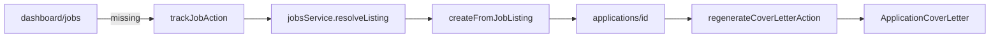

# Wave 3 — Application backend (Milestone B)

## Current state (audit)

Most of Wave 3 is **already built** on Postgres. The gap is **integration**, not greenfield service work.



| ID | Status | Notes |
|----|--------|-------|
| W3.1 | Done | [`service.ts`](src/lib/applications/service.ts) — create, bundle, notes, snapshots on Postgres |
| W3.2 | Mostly done | All 6 routes use `getSession` + service; **gap:** `POST .../cover-letters` only `upsertLetter`, not AI generate |
| W3.3 | Partial | [`track-job.ts`](src/lib/applications/track-job.ts) implemented but **never called**; no app id returned |
| W3.4 | Missing | [`jobs/page.tsx`](src/app/dashboard/jobs/page.tsx) — save + external link only |
| W3.5 | Partial | [`create-manual.ts`](src/lib/applications/create-manual.ts) works; redirects to `/dashboard?tracked=1` |
| W3.6 | Missing | `resumeId` never set on `createFromJobListing` / `createManual` |
| W3.7 | Partial | AI works via [`regenerateCoverLetterAction`](src/lib/applications/generate-cover-letter.ts) on detail; [`generateCoverLetterForBody`](src/lib/applications/cover-letter/generate-route.ts) unwired from API |
| W3.8 | Partial | [`TrackedToast`](src/components/dashboard/tracked-toast.tsx) only on applications list; redirects target wrong URL |

**Prereqs:** Wave 1 auth, Wave 2B profile (letter grounding uses profile snapshots).

---

## Execution order

1. **W3.3 + W3.4** — Track loop (highest user value)
2. **W3.5 + W3.8** — Redirects + toast alignment
3. **W3.6** — Auto `resumeId`
4. **W3.7** — API generate branch + optional jobs CTA
5. **W3.1 + W3.2** — Verification pass + doc update
6. **MASTER_BUILD_PLAN** — Status table, expanded how-to, verify checklist

---

## W3.3 — Fix track-job server actions

**File:** [`src/lib/applications/track-job.ts`](src/lib/applications/track-job.ts)

- Change `trackJobById` to **return** `application.id` (string) from `createFromJobListing` (handles dedup via existing row).
- `trackJobAction`: after track, `redirect(\`/dashboard/applications/${id}?tracked=1\`)` instead of `/dashboard?tracked=1`.
- Optional: support `?track={jobId}` on jobs page — on mount, if param present, call `trackJobById` once (server action via form or small route).

**Job resolution:** Already correct — [`jobsService.resolveListing`](src/lib/jobs/resolve-listing.ts) uses cached `Job` / saved listing, not deleted core.

---

## W3.4 — Jobs UI: Track application

**File:** [`src/app/dashboard/jobs/page.tsx`](src/app/dashboard/jobs/page.tsx) (client page)

Add per job card (next to bookmark / external link):

```tsx
<form action={trackJobAction}>
  <input type="hidden" name="jobId" value={job.id} />
  <button type="submit">Track application</button>
</form>
```

- Import `trackJobAction` from `@/lib/applications/track-job`.
- Use `useFormStatus` or disabled state during submit for loading affordance.
- **Optional (W3.7 stretch):** secondary button calling `generateCoverLetterFromJobAction(job.id)` with `useTransition`, then `router.push(/dashboard/applications/${applicationId})` on success.

**UX copy:** "Track application" creates a draft in Application Hub; does not auto-generate letter unless second button added.

---

## W3.5 — Manual application E2E

**Files:** [`create-manual.ts`](src/lib/applications/create-manual.ts), [`applications/new/page.tsx`](src/app/dashboard/applications/new/page.tsx)

- Capture return value: `const application = await applicationsService.createManual(...)`.
- Redirect: `/dashboard/applications/${application.id}?tracked=1`.
- Keep existing form fields; no UI rewrite.

---

## W3.6 — Auto-link latest resume

**File:** [`src/lib/applications/service.ts`](src/lib/applications/service.ts)

Add helper (server-only):

```ts
async function latestActiveResumeId(userId: string): Promise<string | null>
// prisma.resume.findFirst({ where: { userId, isActive: 1 }, orderBy: { uploadedAt: 'desc' } })
```

In `createFromJobListing` and `createManual` `prisma.application.create` data:

- Set `resumeId: await latestActiveResumeId(userId)` when not explicitly provided.
- Reuse existing [`setApplicationResume`](src/lib/applications/service.ts) only if UI later allows pickers.

**Verify:** New application row has `resume_id` when user has an active ATS resume.

---

## W3.7 — Cover letter generation

**Already works on detail:** [`ApplicationLetterEditor`](src/components/applications/application-letter-editor.tsx) calls `regenerateCoverLetterAction` → [`coverLettersService.generateForApplication`](src/lib/applications/cover-letter/generate.ts) → sets `coverLetterId`.

**API alignment** — [`src/app/api/applications/[id]/cover-letters/route.ts`](src/app/api/applications/[id]/cover-letters/route.ts):

- If body matches `coverLetterGenerateSchema` (has `applicationId` / generate flags, no `content`): call `generateCoverLetterForBody(session.id, { applicationId: id, ... })`.
- If body has `content`: keep existing `upsertLetter` (manual save).
- Document in route comment: POST dual-purpose.

**Jobs optional:** Wire `generateCoverLetterFromJobAction` only if product wants one-click track+generate; otherwise defer to Wave 4 polish.

---

## W3.8 — Tracked toast

**Files:** [`tracked-toast.tsx`](src/components/dashboard/tracked-toast.tsx), [`applications/[id]/page.tsx`](src/app/dashboard/applications/[id]/page.tsx)

- Standardize redirect query: `?tracked=1` on **applications** routes only.
- Mount `<Suspense><TrackedToast /></Suspense>` on application **detail** page (in addition to list) so track-from-jobs toast fires after redirect.
- Update toast copy if redirect now lands on detail: e.g. "Application tracked — add notes or generate your cover letter."

Remove reliance on `/dashboard?tracked=1` from all application create flows.

---

## W3.1 / W3.2 — Verification (no rewrites)

**W3.1 checklist:**

- Run `npx tsc --noEmit` and `npm run build`.
- Manual: create from job, manual create, open bundle — confirm snapshots + profile snapshot rows exist.

**W3.2 audit** (confirm each route):

| Route | GET | POST/PATCH/DELETE |
|-------|-----|-------------------|
| `api/applications` | list | manual create |
| `api/applications/[id]` | bundle | update, delete |
| `api/applications/[id]/notes` | list | create |
| `api/applications/[id]/notes/[noteId]` | — | patch, delete |
| `api/applications/[id]/cover-letters` | letter payload | generate OR upsert |
| `api/applications/[id]/cover-letters/[letterId]` | — | patch content |

Pattern unchanged: `getSession` → 401 → `ensureUser` → service.

---

## MASTER_BUILD_PLAN.md updates (on execute)

Update [`docs/MASTER_BUILD_PLAN.md`](docs/MASTER_BUILD_PLAN.md):

1. Set **Wave 3** as **Current wave** in §1.3 handoff (Wave 2B complete).
2. Add status column to W3 task table (Done / Partial / Todo per audit above).
3. Replace W3 how-to blocks with this plan’s substeps + file links.
4. Expand **Verify W3** checklist:
   - Track job from `/dashboard/jobs` → lands on `/dashboard/applications/[id]`
   - Application appears in list with correct company/title
   - Status change + note persist (detail page)
   - Generate letter sets `coverLetterId`; content references job + profile
   - Manual create redirects to detail
   - `resumeId` populated when resume exists
   - `npm run build`
5. Add link: `.cursor/plans/wave_3_application_backend.plan.md` (mirror of this plan).
6. Bump `updated_at` on line 1.

**Out of scope for Wave 3** (Wave 4): dashboard `layout.tsx` shell, full ApplicationTracker on list, Guava button polish.

---

## Risk notes

- **Dedup:** `createFromJobListing` returns existing app for same `jobExternalId` — track button should still redirect to that id (not create duplicate).
- **Client jobs page + server actions:** `<form action={trackJobAction}>` is supported; avoid calling server action directly from onClick without form.
- **AI keys:** Letter generate requires `OPENAI_API_KEY` / OpenRouter — same as profile import.
