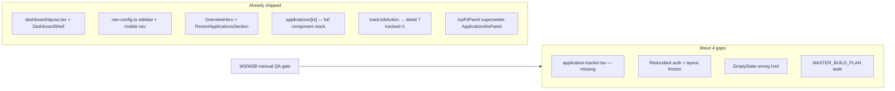

# Wave 4 — Application Hub UI (Detailed Plan)

Per [docs/MASTER_BUILD_PLAN.md](docs/MASTER_BUILD_PLAN.md) §1.3 and §11, the **official next step** is **Wave 4 (Milestone C)**. Wave 3 + 3B backend is implemented; manual verify checkboxes are still open. **Do not mark Milestone C complete until both the QA gate and Wave 4 gaps below are done.**

---

## Current state vs plan (honest audit)



| Wave 4 task | Plan expectation | Actual state |
|-------------|------------------|--------------|
| W4.1 Sidebar layout | `dashboard/layout.tsx` with nav links | **Done** — [src/app/dashboard/layout.tsx](src/app/dashboard/layout.tsx) + [src/components/dashboard/shell.tsx](src/components/dashboard/shell.tsx) (exceeds plan: shadcn sidebar, breadcrumbs, mobile bottom nav, no `/dashboard/cover` link) |
| W4.2 Slim overview | Stats + minimized `ApplicationTracker` | **Partial** — [src/components/dashboard/overview.tsx](src/components/dashboard/overview.tsx) uses `OverviewHero` pipeline stat cards + `RecentApplicationsSection` (last 3 apps). No shared `ApplicationTracker` component. |
| W4.3 Applications list | Full `ApplicationTracker` + table | **Partial** — [src/app/dashboard/applications/page.tsx](src/app/dashboard/applications/page.tsx) has inline stat grid + [ApplicationsTable](src/components/applications/applications-table.tsx). No pipeline strip component; stats logic duplicated vs overview. |
| W4.4 Detail wiring | Mount §5.3 components | **Done** — [src/app/dashboard/applications/[id]/page.tsx](src/app/dashboard/applications/[id]/page.tsx) mounts status, notes, taxonomy, CV, letter (+ grounding via cover section), snapshot, ICP fit, JD section, toasts. |
| W4.5 Remove duplicate nav | Layout owns sidebar | **Mostly done** — no duplicate sidebar in child pages. Remaining: redundant `getSession()` redirects in pages already guarded by layout. |
| W4.6 Guava tokens on CTAs | `bg-guava-pink-gradient` | **Done** on shell header, applications list, overview CTAs. |

**Key architectural note:** [IcpFitPanel](src/components/applications/icp-fit-panel.tsx) absorbed W3 `ApplicationAtsPanel` keyword UI (collapsed under “Your match” tab). [ApplicationAtsPanel](src/components/applications/application-ats-panel.tsx) is **orphaned** — do not mount both; optionally delete or re-export from ICP panel in a later cleanup PR.

---

## Phase 0 — W3/W3B manual QA gate (blocking)

Run these **before** treating Wave 4 as complete. Use a signed-in Supabase user with profile + at least one resume scan optional.

### Milestone B (Wave 3)

| # | Flow | Expected result | Key files |
|---|------|-----------------|-----------|
| 1 | Jobs → **Track application** | Lands on `/dashboard/applications/[id]?tracked=1`, toast fires | [track-job.ts](src/lib/applications/track-job.ts), [jobs/page.tsx](src/app/dashboard/applications/page.tsx) |
| 2 | **Add manually** | Same redirect + toast | [create-manual.ts](src/lib/applications/create-manual.ts) |
| 3 | Change status + add note | Persists after reload | [application-status-form.tsx](src/components/dashboard/application-status-form.tsx), [application-notes-panel.tsx](src/components/dashboard/application-notes-panel.tsx) |
| 4 | **Generate cover letter** | `coverLetterId` set; letter content uses profile + JD | [application-cover-letter-section.tsx](src/components/applications/application-cover-letter-section.tsx) |
| 5 | Edit letter → recompute | ICP/keyword scores refresh | [icp-fit-panel.tsx](src/components/applications/icp-fit-panel.tsx), ATS hooks in service |
| 6 | `/dashboard/resume` | Still ATS-only; does **not** mutate profile | [resume/page.tsx](src/app/dashboard/resume/page.tsx) |

### Wave 3B (ICP fit)

| # | Flow | Expected result |
|---|------|-----------------|
| 7 | Tracked job with cached JD | JD visible in main column without manual paste |
| 8 | After analyze | Green/amber/red hero + dimension rows |
| 9 | Profile edit → snapshot refresh → recompute | Dimension scores update |
| 10 | Second user, same `jobExternalId` | Shared ICP cache (no duplicate LLM extract) |
| 11 | Generate letter | Draft references top ICP gaps (subjective check) |

### Build gate

```bash
npm run build && npx tsc --noEmit
npx prisma migrate deploy   # on target Supabase DB
```

**If any QA item fails:** fix in Wave 3 scope first; do not paper over with Wave 4 UI work.

---

## Phase 1 — Build missing `ApplicationTracker` (W4.2 + W4.3 core gap)

The plan and [PROJECT_STRUCTURE.md](docs/PROJECT_STRUCTURE.md) reference `src/components/dashboard/application-tracker.tsx`, but it **does not exist**. Duplicate counting lives in three places today:

- [overview-hero.tsx](src/components/dashboard/overview-hero.tsx) — `PipelineStatsRow`
- [applications/page.tsx](src/app/dashboard/applications/page.tsx) — inline stat grid (lines 65–86)
- [pipeline-stats.ts](src/lib/dashboard/pipeline-stats.ts) — partial overlap

### 1.1 Create shared component

**New file:** `src/components/dashboard/application-tracker.tsx`

```tsx
type ApplicationTrackerProps = {
  applications: ApplicationListItem[]
  variant: "compact" | "full"
  activeStage?: PipelineStageFilter   // full variant only
  onStageFilter?: (stage) => void     // optional client callback
}
```

**Behavior:**

- **`compact`** (overview): horizontal stage summary using `STAGE_ORDER` from [constants.ts](src/lib/applications/constants.ts) + rejected count. Show total + top 3–5 recent apps as linked chips/rows (can delegate rendering to existing `RecentApplicationsSection` or merge into one component — avoid duplicating list markup twice).
- **`full`** (applications list): visual pipeline strip above table — each stage shows count + `getApplicationRowClass`-colored pill; clicking a stage filters `ApplicationsTable` (lift filter state to page or pass `initialStageFilter` prop into table).

**Shared util:** extend [pipeline-stats.ts](src/lib/dashboard/pipeline-stats.ts) with `computeStageCounts(applications)` returning `{ DRAFT, APPLIED, …, rejected }` so overview and list use one source of truth.

### 1.2 Wire pages

| Page | Change |
|------|--------|
| [overview.tsx](src/components/dashboard/overview.tsx) | Replace or complement `PipelineStatsRow` with `<ApplicationTracker variant="compact" />`. Keep `RecentApplicationsSection` if compact tracker does not include the recent list — **pick one** recent-apps UX to avoid duplication. |
| [applications/page.tsx](src/app/dashboard/applications/page.tsx) | Remove inline stat grid; add `<ApplicationTracker variant="full" />` above `ApplicationsTable`. Fix [EmptyState](src/components/empty-state.tsx) action: `href="/jobs"` → `href="/dashboard/jobs"` (bug on line 96). |

### 1.3 Optional list enhancement (still W4.3)

Add compact **overall fit badge** on list rows from `ApplicationListItem` if ATS score is already on list DTO; if not in DTO, defer to Wave 7 polish (master plan defers list badge to post-W3).

---

## Phase 2 — Layout and auth cleanup (W4.5)

### 2.1 Trust layout auth

[src/app/dashboard/layout.tsx](src/app/dashboard/layout.tsx) already calls `getSession()` + `ensureUser()`. Child pages can drop redundant auth blocks:

- [applications/page.tsx](src/app/dashboard/applications/page.tsx)
- [applications/[id]/page.tsx](src/app/dashboard/applications/[id]/page.tsx)
- [applications/new/page.tsx](src/app/dashboard/applications/new/page.tsx)
- [profile/page.tsx](src/app/dashboard/profile/page.tsx)

Keep `ensureUser` only where layout does not run (API routes, server actions). Pages should rely on layout for redirect.

### 2.2 Detail page shell cohesion

[src/app/dashboard/applications/[id]/page.tsx](src/app/dashboard/applications/[id]/page.tsx) uses `min-h-screen bg-background` and its own hero header — this fights the shell’s padded canvas. Refactor to:

- Remove `min-h-screen`; use `max-w-5xl mx-auto` only (same as other dashboard pages).
- Keep status-colored hero border via `getApplicationRowClass` on a section wrapper, not full viewport background.

### 2.3 Orphan cleanup (small)

- Remove unused import of `ApplicationAtsPanel` if nothing references it after ICP migration, or add a one-line comment in `application-ats-panel.tsx` marking deprecated.
- Rename misleading `ApplicationTrackerProps` type alias inside [applications-table.tsx](src/components/applications/applications-table.tsx) to `ApplicationsTableProps`.

---

## Phase 3 — Verify Milestone C (W4 acceptance)

Checklist from master plan §Wave 4 Verify:

- [ ] `/dashboard/applications` — full pipeline strip + table + empty state with correct links
- [ ] `/dashboard` — minimized tracker / recent apps + stats; no duplicate nav
- [ ] `/dashboard/applications/[id]` — all §5.3 components render; fits inside shell
- [ ] Row colours from [row-styles.ts](src/lib/applications/row-styles.ts) on table, overview recent cards, detail hero
- [ ] All product links under `/dashboard/...` (grep for bare `/jobs`, `/profile`, `/applications`)
- [ ] `npm run build` + signed-in smoke through track → detail → generate letter

---

## Phase 4 — Update master plan handoff

After verify passes, update [docs/MASTER_BUILD_PLAN.md](docs/MASTER_BUILD_PLAN.md):

- Mark Wave 3/W3B verify boxes checked (or note failures).
- Mark Wave 4 tasks W4.1–W4.6 `[x]` with notes where implementation diverged (e.g. `DashboardShell` vs basic sidebar).
- §1.3 **Next:** Wave 5 — Cover AI polish + remove `/dashboard/cover`.
- §11 handoff: Wave 5 start; link Wave 4 completion date.

Also update [docs/PROJECT_STRUCTURE.md](docs/PROJECT_STRUCTURE.md) `application-tracker` path once file exists.

---

## What comes immediately after (Wave 5 preview — out of scope for this wave)

Not part of Wave 4, but this is the **next** master-plan wave once Milestone C is verified:

| Task | Work |
|------|------|
| W5.1 | Wire [CoverLetterMergeAnimation](src/components/ui/cover-letter-merge-animation.tsx) into [ApplicationLetterEditor](src/components/applications/application-letter-editor.tsx) during AI generate |
| W5.3–W5.4 | Delete [dashboard/cover/page.tsx](src/app/dashboard/cover/page.tsx); redirect in `next.config.ts` |
| W5.5–W5.6 | Stop legacy `LegacyCoverLetter` writes; set `isUserEdited` on manual save |

---

## Recommended execution order

1. **Phase 0** — Manual QA (1–2 hours); log failures as issues.
2. **Phase 1** — `application-tracker.tsx` + page wiring + empty-state fix.
3. **Phase 2** — Layout/auth cleanup + detail page shell fix.
4. **Phase 3** — Milestone C verify + build.
5. **Phase 4** — Doc sync and handoff to Wave 5.

**Estimated scope:** one focused PR (~4–6 files touched, 1 new component, no schema changes).
