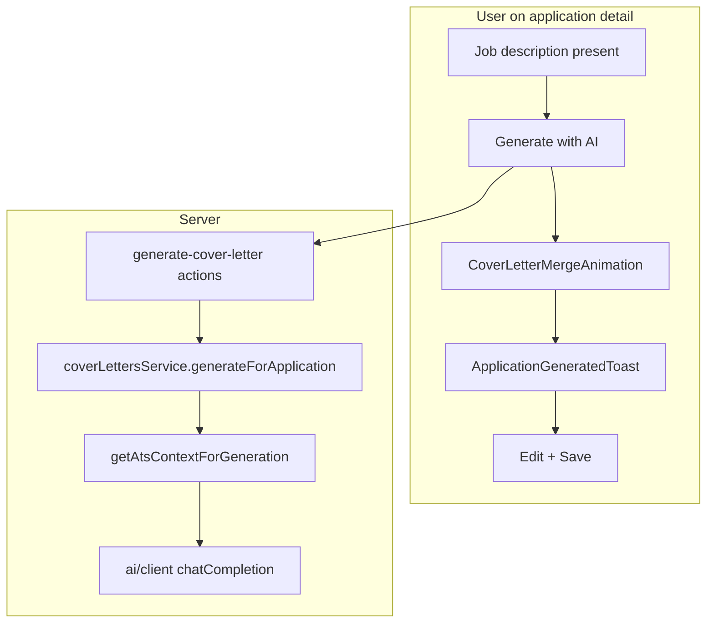

# Wave 5 — Cover AI polish (completion plan)

Per [engineer.mdc](.cursor/rules/engineer.mdc): **Understand → Simulate → Plan → Ship**. Wave 5 **code is shipped**; remaining work is **verify, fix regressions, close the plan**.

---

## Phase 1 — Current state brief

| Area | Status |
|------|--------|
| Canonical cover letter path | **Done** — `generateCoverLetterForApplicationAction` → [`cover-letter/generate.ts`](src/lib/applications/cover-letter/generate.ts) → [`ai/generate-cover-letter.ts`](src/lib/ai/generate-cover-letter.ts) → `chatCompletion` + ICP/ATS context |
| Merge animation | **Done** — [`application-letter-editor.tsx`](src/components/applications/application-letter-editor.tsx) swaps textarea for [`CoverLetterMergeAnimation`](src/components/ui/cover-letter-merge-animation.tsx); `?generated=1` triggers toast |
| `isUserEdited` | **Done** — DTO + badges; AI save clears flag in [`cover-letter/index.ts`](src/lib/applications/cover-letter/index.ts) |
| Legacy `/dashboard/cover` | **Removed** — page + API deleted; redirects in [`next.config.ts`](next.config.ts) |
| `LegacyCoverLetter` writes | **Stopped** — no `legacyCoverLetter.create` in `src/` |
| W5.2 `llm.ts` unification | **Deferred** — chat/resume still use [`llm.ts`](src/lib/llm.ts); cover path never touches it |
| MASTER_BUILD_PLAN verify | **1 item open** — manual QA for generate + animation flow |



---

## Phase 2 — User journey (what to validate)

**Persona:** Student tracking an internship; anxious about sounding generic; wants proof the letter used *their* profile and the *job*.

| Step | Expected experience | Risk if broken |
|------|---------------------|----------------|
| Open application detail | JD visible; cover letter section collapsible | Can't generate |
| Click **Generate with AI** | Merge animation replaces textarea; buttons disabled | Feels broken / no feedback |
| ~15–30s wait | Animation cycles inputs → merging → generating | User abandons |
| Success | Brief “complete” state → toast “Cover letter ready” → letter text appears | Trust loss |
| Badge shows **AI draft** | Clear it's not final | User submits unreviewed AI text |
| Edit + **Save** | Badge → **Edited by you**; persists on reload | Data loss fear |
| Visit `/dashboard/cover` | Redirects to applications list | Dead link / confusion |

Aligns with [NOTES.md](NOTES.md) item 3: application-scoped generator + merge animation on generate.

---

## Phase 3 — Execution plan (ordered)

### Step 0 — Automated gate (5 min)

Run before browser QA:

```bash
npm run build && npx tsc --noEmit
rg 'api/cover|dashboard/cover|legacyCoverLetter\.create' src   # expect 0 matches (nav comment OK)
```

Confirm redirects exist in [`next.config.ts`](next.config.ts) lines 31–40.

---

### Step 1 — Manual QA script (blocking for wave closure)

Use a signed-in user with profile name filled + application that has job description text.

| # | Action | Pass criteria |
|---|--------|---------------|
| 1 | `/dashboard/applications/[id]` → **Generate with AI** | Animation visible; no textarea during generate |
| 2 | Wait for completion | Success animation → Sonner toast; letter content populated |
| 3 | Reload page | Letter persists; **AI draft** badge |
| 4 | Edit text → **Save cover letter** | **Edited by you** badge; reload confirms |
| 5 | **Regenerate with AI** (edited letter) | Confirm dialog warns about replacement; badge returns to **AI draft** |
| 6 | Navigate to `/dashboard/cover` | Lands on `/dashboard/applications` |
| 7 | Sidebar / mobile nav | No link to legacy cover |

**Prereqs for generate:** `OPENAI_API_KEY` or `OPENROUTER_API_KEY` in `.env.local`; profile completeness sufficient for [`isProfileReadyForAi`](src/lib/ai/profile-readiness.ts).

On pass: check the open box in [MASTER_BUILD_PLAN.md](docs/MASTER_BUILD_PLAN.md) §Verify W5 (line ~616).

---

### Step 2 — Fix-only-if-QA-fails (no preemptive work)

Only implement if manual QA surfaces an issue:

| Tier | Issue | Fix (single file, no new routes) |
|------|-------|----------------------------------|
| Critical | Animation never shows / stuck | Check `showMergeAnimation` lifecycle in [`application-letter-editor.tsx`](src/components/applications/application-letter-editor.tsx); ensure `generatePending` clears on action return |
| Critical | Letter empty after success | Ensure `useEffect` on `initialLetter` syncs `content` after `router.refresh()`; consider keeping animation until `initialLetter?.content` updates |
| High | Toast doesn't fire | Verify `router.replace(\`${pathname}?generated=1\`)` runs before refresh; [`application-generated-toast.tsx`](src/components/applications/application-generated-toast.tsx) mounted on detail page |
| High | Generate fails with profile error | Complete profile (display name) per service validation |
| Polish | Flash of empty textarea post-animation | Extend animation until `initialLetter` prop updates (compare `initialLetter?.updatedAt`) |

**Do not** re-add `/dashboard/cover` or `api/cover/generate`.

---

### Step 3 — Doc hygiene (10 min, after QA pass)

| File | Change |
|------|--------|
| [docs/MASTER_BUILD_PLAN.md](docs/MASTER_BUILD_PLAN.md) | Check manual QA box; keep Wave 5 ✅ |
| [docs/MASTER_BUILD_PLAN.md](docs/MASTER_BUILD_PLAN.md) §5.2 | Remove stale `api/cover/generate/route.ts` from legacy API list (line ~825) |
| [NOTES.md](NOTES.md) | Optionally note merge animation is wired on application detail (item 3) |

**Out of scope for Wave 5:** README rewrite (Wave 7), `llm.ts` → `ai/client` shim (optional W5.2 follow-up).

---

### Step 4 — Handoff to Wave 6

When Verify W5 is fully checked:

- §1.3 **Next:** Wave 6 — saved searches panel + scrape params ([MASTER_BUILD_PLAN.md](docs/MASTER_BUILD_PLAN.md) §Wave 6)
- No Wave 5 code changes required unless Step 2 fixes apply

---

## Task checklist (maps to MASTER_BUILD_PLAN W5.x)

| ID | Task | Code status | Remaining |
|----|------|-------------|-----------|
| W5.1 | Merge animation in editor | Shipped | Manual QA |
| W5.2 | Application AI via `ai/client.ts` | Shipped | Optional `llm.ts` shim later |
| W5.3 | Delete legacy cover page | Shipped | — |
| W5.4 | Redirect `/dashboard/cover` | Shipped | — |
| W5.5 | Stop `LegacyCoverLetter` writes | Shipped | — |
| W5.6 | `isUserEdited` UI | Shipped | Manual QA badge flow |

---

## Success criteria (wave officially complete)

- All W5 verify checkboxes `[x]` in MASTER_BUILD_PLAN
- Single cover-letter path: application detail only
- User sees merge animation + AI draft / edited badges
- `npm run build` passes
- Ready to start Wave 6 without cover-letter debt
