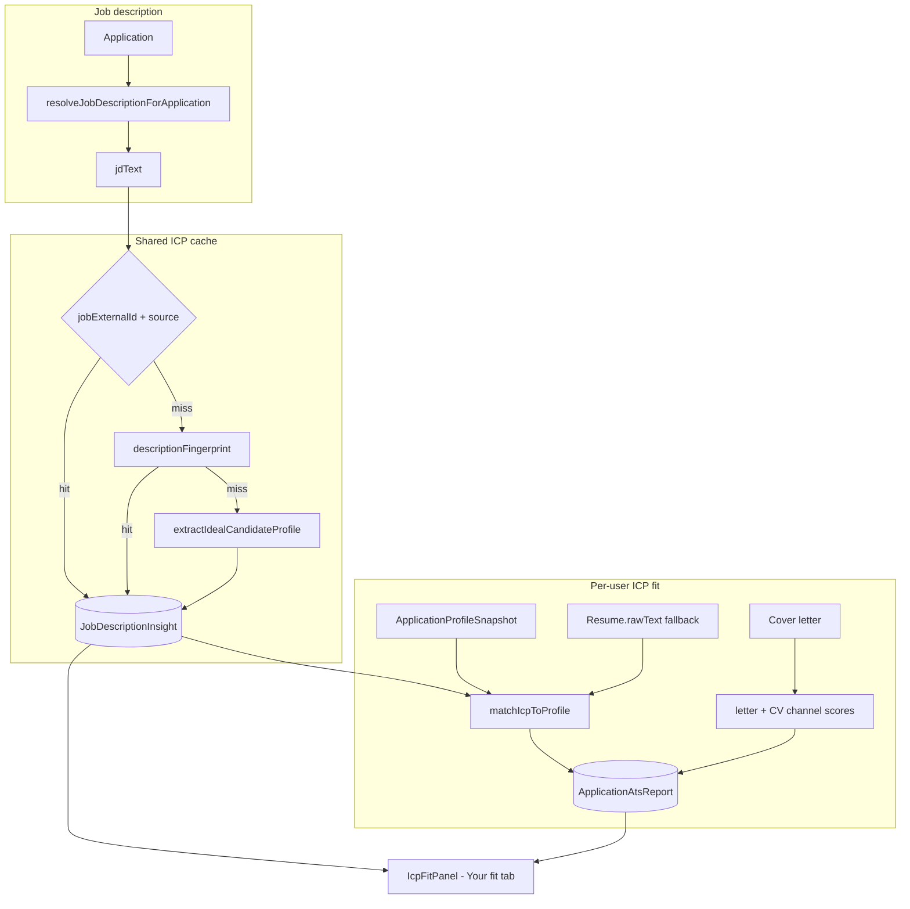

# Wave 3B — Ideal Candidate Profile (ICP) Fit

## Product goal

Give users **instant clarity** on two questions:

1. **What is the job lister's Ideal Candidate Profile (ICP)?** — skills, experience, education, seniority, traits, and themes they expect to see in a CV and cover letter.
2. **How well does *your* profile match that ICP?** — scored per dimension with **traffic-light colours** (green / amber / red) so users know at a glance whether they meet the lister's requirements.

This is **not** resume-document ATS (that stays on `/dashboard/resume`). This is **role-specific ICP intelligence** on the application hub.

---

## Current state brief

- [`ApplicationAtsPanel`](src/components/applications/application-ats-panel.tsx) scores **cover letter + CV text** against thin keywords — it does **not** model an ICP or compare the **profile snapshot**.
- [`analyze-job.ts`](src/lib/applications/ats/analyze-job.ts) extracts only basic skills/summary — not a structured ICP.
- Insights are **per-application**, not shared; **"Analyze now"** often fails when JD is missing ([`recompute.ts`](src/lib/applications/ats/recompute.ts) returns `null` → misleading 404).
- No traffic-light UX; scores use % only with Weak/Fair/Strong labels.

---

## Architecture

**Two layers:**

| Layer | Table | Scope | Purpose |
|-------|-------|-------|---------|
| **ICP intelligence** | `JobDescriptionInsight` | Shared across users | LLM extracts lister's ideal candidate from JD; cached by `jobExternalId` + `source`, fallback `descriptionFingerprint` |
| **ICP fit** | `ApplicationAtsReport` | Per application | Profile-vs-ICP match + letter/CV channel scores |

---

## Phase 1 — Fix JD resolution (critical)

[`resolveJobDescriptionForApplication`](src/lib/applications/snapshots.ts):

- Read `jobDescriptionText` → `jobDescriptionSnapshot`.
- Backfill from `resolveJobForUser(userId, jobExternalId)` when empty; persist to application.
- API: 422 when no JD, 502 on LLM failure (not silent 404).

---

## Phase 2 — Schema

**`JobDescriptionInsight`** — stores extracted ICP (shared):

- `icpJson` — full `IdealCandidateProfile`
- `keywordsJson` — ATS keywords derived from ICP
- Cache: `jobExternalId` + `jobSource` primary; `descriptionFingerprint` fallback

**`Application`**: `jobInsightId` FK.

**`ApplicationAtsReport`**: add `icpMatchJson` with per-dimension traffic-light match. Keep `letterMatchJson`, `cvMatchJson` for document channels.

---

## Phase 3 — ICP extraction (LLM)

**`IdealCandidateProfile`** fields: `roleSummary`, `seniority`, `mustHaveSkills`, `niceToHaveSkills`, `experience` (years, domains, evidence phrases), `education`, `qualifications`, `softTraits`, `keyResponsibilities`, `cvEmphasis`, `coverLetterThemes`, `keywordsForAts`.

Prompt: *"Infer the Ideal Candidate Profile the lister wants. Return JSON only."*

---

## Phase 4 — ICP fit matching

**`matchIcpToProfile(icp, profileSnapshot, cvText)`** → `IcpMatchReport`:

- Dimensions: skills, experience, education, seniority, qualifications
- Each dimension: `status` (`met` | `partial` | `missing`) + score 0–100 + met/partial/missing lists + evidence/gap copy
- **Overall traffic light**: green ≥75% with no critical skill gaps; amber 45–74%; red <45%

**Blended overall score**: 60% ICP profile match + 40% letter/CV channels (when documents exist).

---

## Phase 5 — Cover letter enrichment

Pass `topGaps`, `cvEmphasis`, `coverLetterThemes` to cover letter prompt. Close gaps only with truthful profile evidence.

---

## Phase 6 — API

`GET/POST /api/applications/[id]/ats` returns `{ report, icp, icpMatch }` with `overallStatus` for traffic-light hero.

---

## Phase 7 — UI: `IcpFitPanel`

**Hero:** large traffic-light dot + "Strong / Partial / Weak ICP match" + overall %

**Tab "Ideal candidate":** full ICP breakdown from shared cache

**Tab "Your fit":** dimension rows with green/amber/red dots, progress bars, expandable met/partial/missing chips, top gaps & strengths

**Empty state:** paste JD → analyze. **Loading:** skeleton. Document channel scores collapsible below.

Traffic-light tokens: `emerald` (met), `amber` (partial), `red` (missing) — dark-mode safe.

---

## Phase 8 — Documentation

Update [`docs/MASTER_BUILD_PLAN.md`](docs/MASTER_BUILD_PLAN.md) with Wave 3B ICP framing.

Full plan: [wave_3b_job_description_insights.plan.md](.cursor/plans/wave_3b_job_description_insights.plan.md)

---

## Verify

- Traffic-light hero renders correctly for strong/partial/weak scenarios
- Dimension rows update after profile snapshot refresh + recompute
- Shared ICP cache across users on same `jobExternalId`
- Cover letter uses ICP gaps
